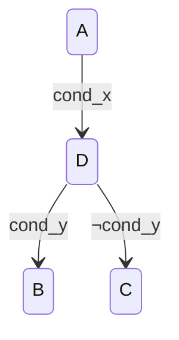
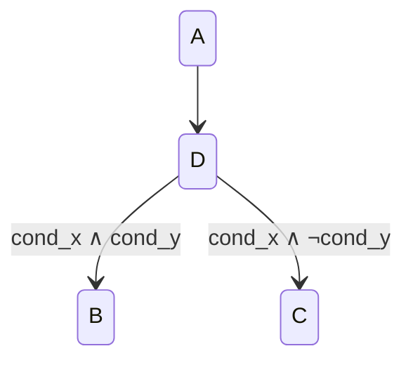
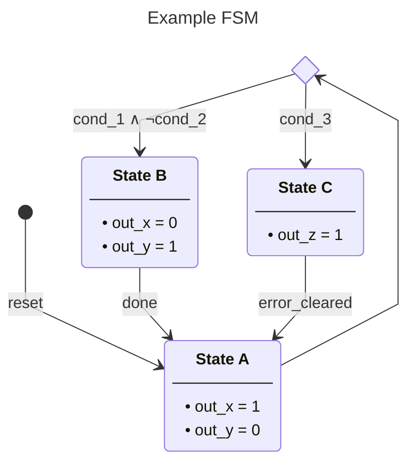

# Mermaid FSM Style Guide: `detailed_fsm_trace_style_v1`

## Purpose

This style is for architecture documentation where FSM diagrams must reflect RTL behavior precisely and remain readable in reviews and thesis/report documents.

Use this style for:
- TX/RX control FSMs (`tx_llc`, `tx_mac_ser`, `tx_mac_fsm`, `tx_pcs`)
- protocol/monitor FSMs where transition guards matter

Do not use this style for:
- high-level conceptual sketches
- generic block diagrams without code-level mapping

## Core Rule: Code-Trace Fidelity

Every diagram edge and state action must be traceable to real code.

Required:
1. Read the actual RTL (`next_state_logic` + output logic) before editing diagrams.
2. Use the same signal names as code where possible.
3. Show only real state-changing transitions.
4. Keep guard priority consistent with coded precedence.
5. If a state exists but has no entry path in current RTL, note it explicitly.

Forbidden:
1. Inventing transitions not present in code.
2. Rewording guards into ambiguous prose.
3. Adding noisy "otherwise" self-loops unless they add real semantic value.

## Diagram Header Format

Use this exact header shape:


## Node Text Format

Use rich state labels with this structure:
- bold state name
- separator line
- bullet list of state outputs/actions

Pattern:

```text
"**State Name**<br/>─────────<br/>• output/action 1<br/>• output/action 2"
```

Guidelines:
1. Use `<br/>` for line breaks.
2. Use `•` bullet glyph (not markdown list syntax).
3. Keep each bullet short and concrete.
4. Include only outputs/actions owned by that state.
5. Use plain text in node bullets (no markdown backticks / inline-code formatting).
6. Keep bullet lines compact to reduce renderer wrapping; split long thoughts into multiple bullets.
7. Prefer action-oriented phrasing (verb first) so shorter bullets remain clear.

## Edge Label Format

1. Edges that represent transition conditions/events must have labels.
2. Edges entering `<<choice>>` nodes must be unlabeled.
3. Labels should be boolean guards/events, not vague prose.
4. Labels must be plain text (no markdown backticks / inline-code formatting).
5. Prefer logic symbols over C-style operators:
   - `∧` instead of `&&`
   - `∨` instead of `||`
   - `¬` instead of `!`
   - `≥`, `≤` where needed
6. Include explicit context on thresholds:
   - `bit_count = intermission_width - 1`
   - `bit_count ≥ frame_params.eof_stop`

## Choice Node Rules

Use `<<choice>>` only when one decision point branches to multiple next states.

Guidelines:
1. One choice node per logical branch cluster.
2. Route from a state to choice with no edge label.
3. Put mutually exclusive guard labels on outgoing edges only.
4. Do not add choice nodes for single-target transitions.
5. Do not use degenerate choice nodes with one incoming and one outgoing edge; use a direct labeled transition instead.

Hard rule (must):
1. Never place a transition condition label on an edge entering a `<<choice>>` node.
2. All decision conditions must be expressed only on outgoing edges from the choice node.

Bad:


Good:


## Transition Selection Rules

Include:
1. Reset/entry transition (`[*] --> ...`).
2. All real cross-state transitions from `next_state_logic`.
3. Any state transition caused by terminal status conditions.

Exclude:
1. Implicit "hold in same state" behavior unless needed for comprehension.
2. Internal datapath actions that do not change state.

## Notation Conventions

1. Use code identifiers verbatim where possible (`ack_success_seen`, `frame_params.eof_stop`).
2. Keep comparison direction consistent with RTL guards.
3. If code uses constants, prefer symbolic names over expanded numeric values.
4. For reserved/unreached states, add a short note block.

## Verification Checklist (Mandatory Before Merge)

1. State set check:
   - All RTL states represented.
2. Transition check:
   - Every drawn transition exists in code.
   - No missing cross-state transition from code.
3. Guard check:
   - Edge labels match exact guard semantics and precedence.
4. Output check:
   - Node bullets match state-owned outputs/actions in output logic.
5. Consistency check:
   - Symbols and signal names consistent across diagrams in the document.

## Recommended Workflow

1. Extract transitions from `next_state_logic` into a quick table.
2. Extract state actions from output logic into bullet candidates.
3. Draft diagram with minimal transitions first.
4. Add one choice node per real branch cluster.
5. Run the verification checklist.
6. Only then polish labels/format.

## Example Skeleton


