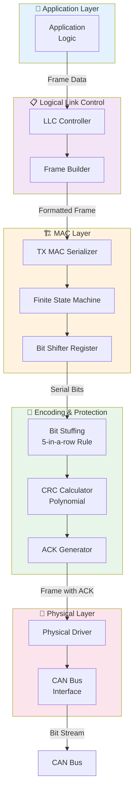
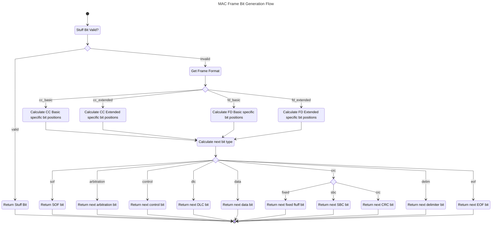
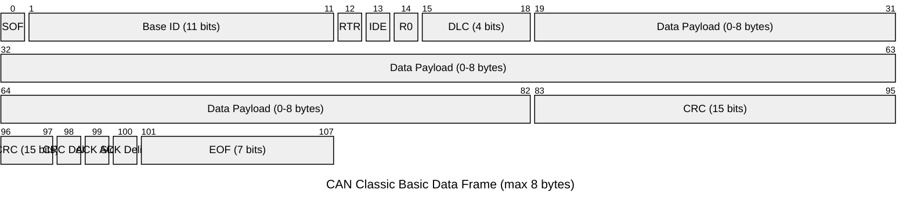
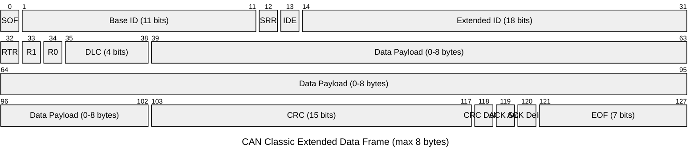
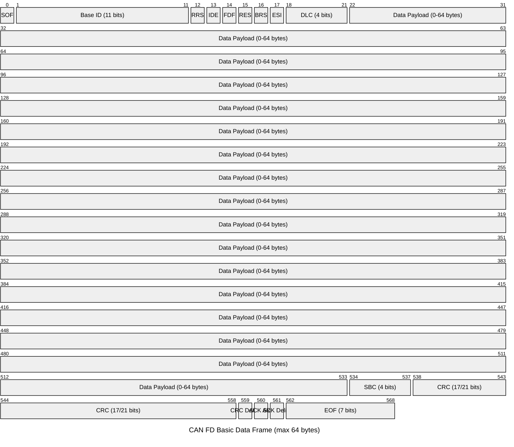
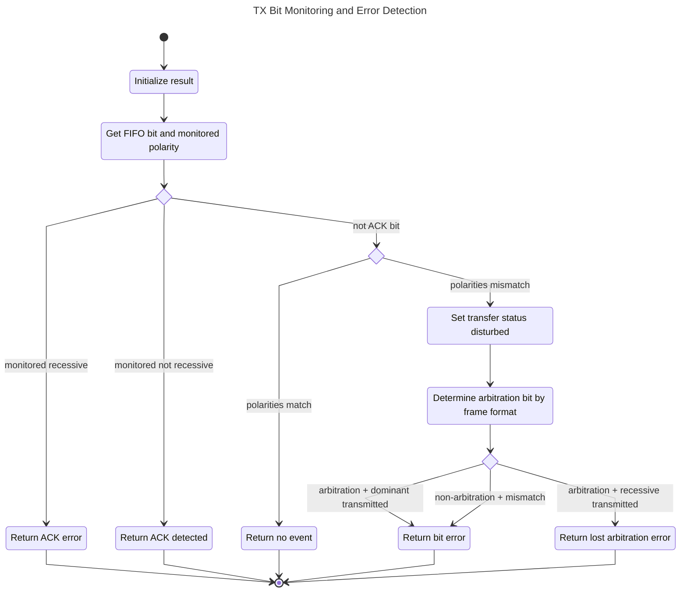

# CAN Bus Implementation Report

## Overview

This document outlines the architecture and implementation of a CAN (Controller Area Network)
bus transmitter following the ISO 11898-1:2015 standard. The implementation includes the
MAC layer serializer, bit stuffing logic, and CRC calculation for both CAN 2.0 and CAN-FD
protocols.

## CAN Stack Architecture

The CAN implementation is organized into distinct layers following the ISO/OSI model:

## Layer Descriptions

### Application Layer

The application layer contains the business logic that generates CAN frames and processes
incoming messages. It interfaces with the LLC layer through well-defined frame structures.

### Logical Link Control (LLC)

The LLC layer is responsible for:
- Frame type selection (data/remote frames)
- Format selection (CAN 2.0 basic/extended, CAN-FD)
- Configuration of frame parameters (DLC, flags, identifiers)
- Passing formatted frames to the MAC layer

### MAC Layer (Media Access Control)

The MAC layer handles:
- **TX MAC Serializer** (`tx_mac_ser.vhd`): Converts 8-bit words into serial bit stream
- **FSM Controller** (`tx_mac_fsm.vhd`): Manages transmission state machine
- **Bit Shifter**: Implements shift register for bit-by-bit transmission

### Encoding & Protection Layer

This layer ensures data integrity through:
- **Bit Stuffing** (`bit_stuffer.vhd`, `bit_stuffer_fd.vhd`): Inserts stuff bits after 5
  consecutive bits of same polarity per ISO 11898-1 Section 8.5.2
- **CRC Calculation** (`crc_fd.vhd`): Computes polynomial-based CRC (15-bit for CAN 2.0,
  17/21-bit for CAN-FD)
- **ACK Generation**: Encodes acknowledgment slot (1 recessive bit expected from receivers)

### Physical Layer

The physical layer provides:
- Driver circuitry for CAN bus signaling
- Dominant (0V, high current) and recessive (pull-up, low current) states
- Interface to the actual CAN bus transmission medium

## Key Implementation Details

### Frame Structure (ISO 11898-1 Section 8.2)

- **SOF**: Start of Frame (1 bit, dominant)
- **Arbitration Field**: ID (11/29 bits) + RTR + IDE
- **Control Field**: Reserved bits + DLC + FD flags (CAN-FD only)
- **Data Field**: 0-64 bytes (0-512 bits)
- **CRC Field**: 15-21 bits + delimiter
- **ACK Field**: 1 bit slot + delimiter
- **EOF**: End of Frame (7 bits, recessive)

### Bit Stuffing Algorithm (ISO 11898-1 Section 8.5.4)

After 5 consecutive bits of the same polarity, a complementary stuff bit is inserted:
- **CAN 2.0**: Dynamic stuffing throughout frame (except CRC delimiter onwards)
- **CAN-FD**: Fixed stuff bits at predefined positions in payload

### CRC Polynomials

- **CAN 2.0**: x^15 + x^14 + x^10 + x^8 + x^7 + x^4 + x^3 + 1 (0xC599)
- **CAN-FD 17-bit**: High bandwidth CRC
- **CAN-FD 21-bit**: Maximum protection CRC

## Testing Strategy

Comprehensive testing includes:
- Unit tests for each layer component
- Integration tests for full frame transmission
- Edge case testing (min/max DLC, various frame types)
- Bit stuffing validation with various bit patterns
- CRC correctness verification against reference implementations

## Compliance

This implementation strictly adheres to:
- **ISO 11898-1:2015** - CAN Data Link Layer and Physical Signaling
- **CAN 2.0 Specification** - Classical CAN protocol
- **CAN-FD Protocol** - Flexible Data Rate extensions

For detailed protocol specifications, refer to `ISO_11898_1_CAN_bus_link.pdf`.

## MAC Frame Bit Generation (`get_next_mac_frame_bit`)

The core function responsible for generating each MAC frame bit follows a hierarchical decision flow:

### Function Algorithm

The `get_next_mac_frame_bit` function generates the next bit in a CAN frame transmission. Key stages:

1. **Stuff Bit Priority** (Line 780-783): Checks if the bit stuffer has a valid stuff bit to insert.
   If yes, returns immediately with the complementary polarity.

2. **Frame Format Setup** (Line 797-891): Based on frame format (CAN Classic basic/extended or CAN FD
   basic/extended), loads format-specific bit positions and control field constants.

3. **Field Position Calculation** (Line 897-915): Calculates the position of each frame section:
   - Data field start/stop
   - CRC field start
   - SBC field (CAN FD only)
   - Fixed stuff bit positions (CAN FD only)
   - ACK and EOF positions

4. **Field Determination** (Line 920-996): Uses a cascading if-elsif chain to determine which field
   the current `bit_count` belongs to:
   - **SOF**: Always dominant (line 920-921)
   - **Arbitration**: Base ID bits + optional extended ID (line 923-939)
   - **Control**: Format flags (RTR, SRR, IDE, R0, R1, FDF, RES, BRS, ESI) with frame-dependent polarities
   - **DLC**: 4-bit data length code (line 954-957)
   - **Data**: 0-512 bits of user payload (line 960-962)
   - **CRC**: 15-21 bit CRC value with optional SBC and fixed stuff bits (line 965-982)
   - **Delimiters & ACK**: CRC/ACK delimiters and ACK slot (recessive) (line 983-990)
   - **EOF**: 7 recessive bits (line 993-994)

5. **Polarity Extraction**: Extracts actual bit polarity from:
   - **Input data**: Frame data for ID/data fields (via `mac_ser_to_fsm.data`)
   - **DLC vector**: DLC field bits
   - **CRC vector**: CRC field bits
   - **SBC vector**: Sequence Bit Count field (CAN FD)
   - **Previous polarity**: For fixed stuff bits (opposite of previous)
   - **Constants**: For fixed-polarity bits (SOF, delimiters, format flags)

## CAN Frame Structure Visualization

### CAN Classic Basic Frame (ISO 11898-1 Section 8.2)

### CAN Classic Extended Frame (ISO 11898-1 Section 8.2)

### CAN FD Basic Frame (ISO 11898-1 Section 8.4)

## TX Monitoring and Error Detection (`get_observed_mac_frame_bit_info`)

The core monitoring function that detects transmission errors, ACK issues, and arbitration loss by comparing expected vs. observed bit polarities:

### Function Algorithm

The `get_observed_mac_frame_bit_info` function monitors transmitted bits for errors (ISO 11898-1: 6.6.21.2). Key stages:

1. **Initialization** (Line 448-449): Set event_type to `none` and transfer_status to `ongoing`.

2. **Get FIFO Entry** (Line 452-454): Extract the transmitted bit at the specified delay from FIFO and capture observed polarity.

3. **ACK Bit Detection** (Line 457-466): Highest priority check - if transmitted bit is ACK:
   - Monitored polarity = recessive? → ACK error, disturbed status, return
   - Monitored polarity ≠ recessive? → ACK detected, transmitted status, return

4. **Polarity Match Check** (Line 469-474): If polarities match → no event detected, return with ongoing status. Otherwise, set transfer_status to `disturbed` and continue.

5. **Arbitration Phase Determination** (Line 477-497): Based on frame format, determine if this bit is in arbitration phase:
   - **CC Basic**: Base ID bits or RTR bit
   - **CC Extended**: Base ID, SRR, IDE, Extended ID, or RTR bits
   - **FD Basic**: Base ID or RRS bits
   - **FD Extended**: Base ID, SRR, IDE, or Extended ID bits

6. **Event Type Resolution** (Line 500-512): With polarity mismatch confirmed:
   - If arbitration bit:
     - Transmitted dominant, observed recessive → bit_error
     - Transmitted recessive, observed dominant → lost_arbitration (transfer_status = lost_arbitration)
   - If non-arbitration bit:
     - Any mismatch → bit_error

## Future Work

- [ ] Remote frame transmission support (Section 8.3)
- [ ] Error frame handling (Section 8.6)
- [ ] Receiver implementation (RX path)
- [ ] Arbitration logic for multi-master scenarios
- [ ] Timing analysis and synchronization
