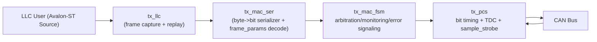
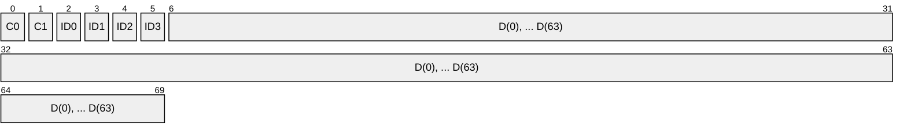
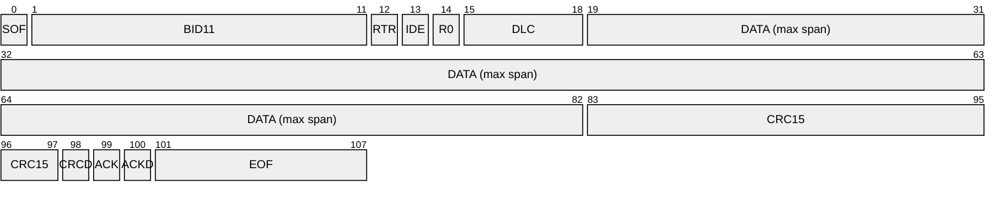
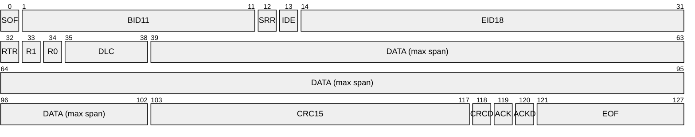
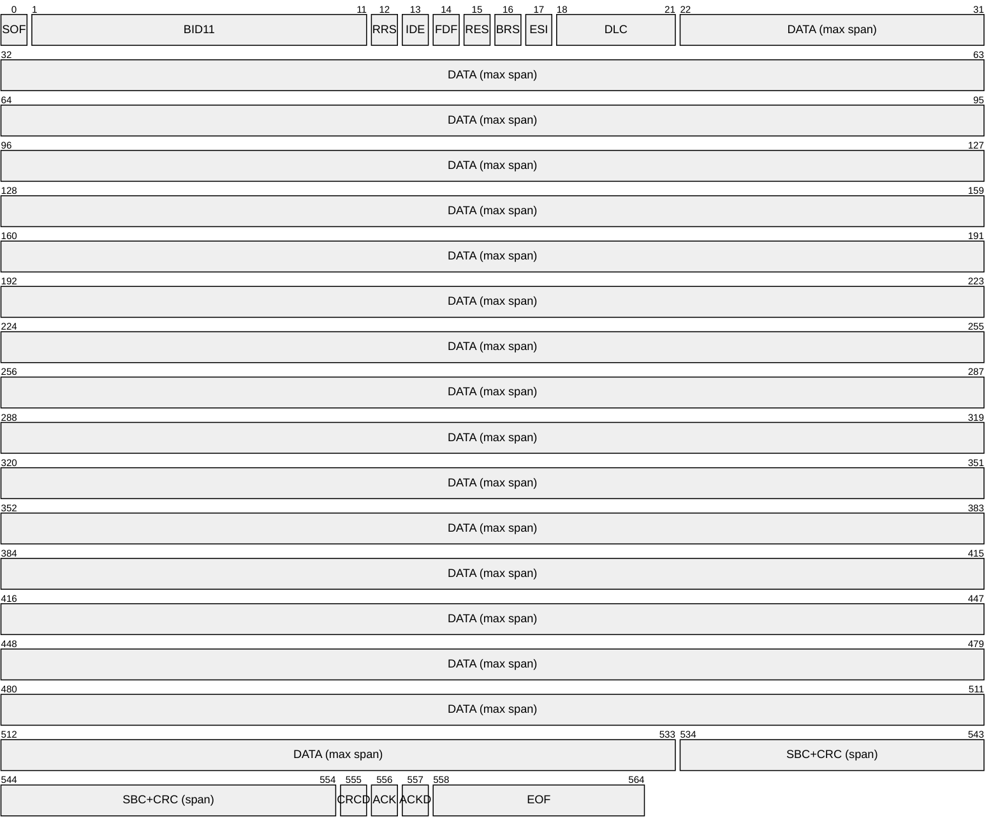
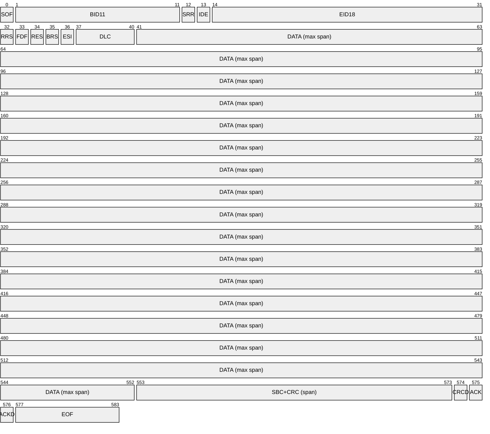
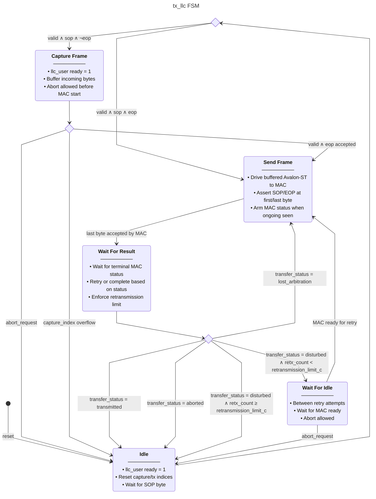
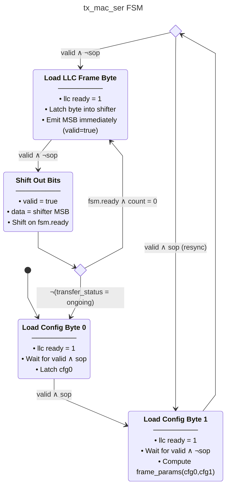
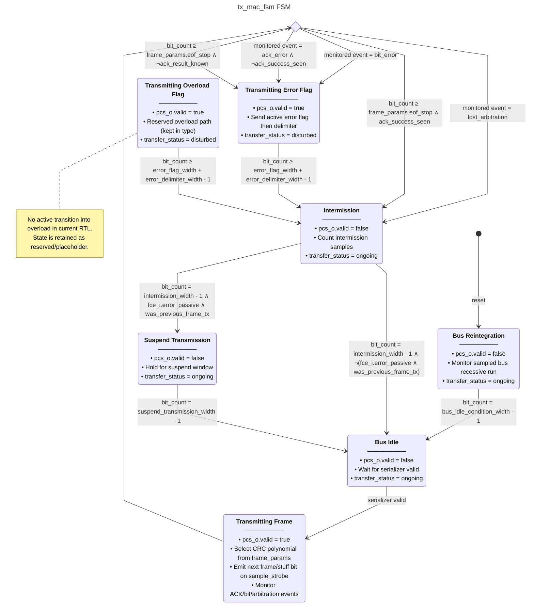
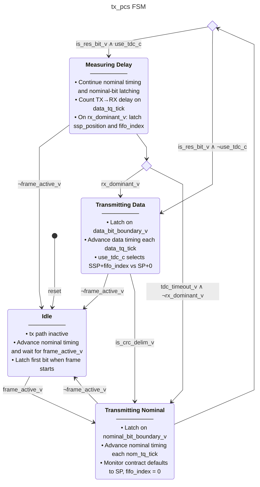

# CAN Bus Implementation Report

<!-- mtoc-start -->

- [1. Overview](#1-overview)
- [2. Current TX Architecture](#2-current-tx-architecture)
- [3. Interface Summary](#3-interface-summary)
  - [3.1 LLC User <-> LLC](#31-llc-user---llc)
  - [3.2 LLC <-> MAC](#32-llc---mac)
  - [3.3 MAC <-> PCS](#33-mac---pcs)
- [4. LLC Frame Format (User Stream and LLC->MAC Stream)](#4-llc-frame-format-user-stream-and-llc-mac-stream)
- [5. MAC Frame Format (Logical CAN Bitstream)](#5-mac-frame-format-logical-can-bitstream)
  - [5.1 CAN Classic Base (logical bit fields)](#51-can-classic-base-logical-bit-fields)
  - [5.2 CAN Classic Extended (logical bit fields)](#52-can-classic-extended-logical-bit-fields)
  - [5.3 CAN FD Base (logical bit fields)](#53-can-fd-base-logical-bit-fields)
  - [5.4 CAN FD Extended (logical bit fields)](#54-can-fd-extended-logical-bit-fields)
- [6. State Diagrams](#6-state-diagrams)
  - [6.1 `tx_llc` FSM](#61-tx_llc-fsm)
  - [6.2 `tx_mac_ser` FSM](#62-tx_mac_ser-fsm)
  - [6.3 `tx_mac_fsm` FSM](#63-tx_mac_fsm-fsm)
  - [6.4 `tx_pcs` FSM](#64-tx_pcs-fsm)
- [7. Verification Status](#7-verification-status)
- [8. Known Gaps / Next Steps](#8-known-gaps--next-steps)

<!-- mtoc-end -->

## 1. Overview

This report summarizes the current TX-side CAN/CAN-FD implementation status in this repository.
The design targets ISO 11898-1 behavior for the transmitter pipeline:

`LLC user -> tx_llc -> tx_mac (serializer + FSM + CRC + stuffer) -> tx_pcs -> bus`

The codebase is VHDL-2008 and uses GHDL + OSVVM for simulation.

## 2. Current TX Architecture

Diagram level: `L3`

## 3. Interface Summary

### 3.1 LLC User <-> LLC

- `llc_user_to_llc_if_t` now uses:
  - `avalon_st_source` (`data`, `valid`, `sop`, `eop`)
  - `abort_request`
- `llc_to_llc_user_if_t` now uses:
  - `avalon_st_sink.ready`
  - `transfer_status`

This aligns the external user boundary with the same stream concept used inside LLC->MAC.

### 3.2 LLC <-> MAC

- Avalon-ST stream: bytes buffered by `tx_llc`, replayed to `tx_mac_ser`.
- MAC returns:
  - backpressure (`ready`)
  - transfer result (`ongoing`, `transmitted`, `disturbed`, `lost_arbitration`, `aborted`)

### 3.3 MAC <-> PCS

- MAC drives bit intent (`mac_frame_bit_t`) and `valid`.
- PCS returns:
  - observed `bus_polarity`
  - effective `sample_strobe`
  - effective `fifo_index` for delayed comparison.

## 4. LLC Frame Format (User Stream and LLC->MAC Stream)

The canonical LLC stream format is byte oriented with:

- mandatory 6-byte header (`CFG0`, `CFG1`, `ID3`, `ID2`, `ID1`, `ID0`)
- optional payload (`0..64` data bytes)

LLC frame packet layout (fixed byte chunks, max FD envelope):

Legend: base-ID formats use `ID1:ID0`; extended-ID formats use `ID3:ID0`.

| b7        | b6        | b5        | b4   | b3  | b2  | b1       | b0       |
| --------- | --------- | --------- | ---- | --- | --- | -------- | -------- |
| FORMAT[2] | FORMAT[1] | FORMAT[0] | FTYP | ESI | BRS | Reserved | Reserved |

**Table 1**: Config Byte 0 bit layout (MSB-left, b7 to b0)

`Config Byte 1` bit layout (MSB-left, `b7` to `b0`):

| b7     | b6     | b5     | b4     | b3       | b2       | b1       | b0       |
| ------ | ------ | ------ | ------ | -------- | -------- | -------- | -------- |
| DLC[3] | DLC[2] | DLC[1] | DLC[0] | Reserved | Reserved | Reserved | Reserved |

**Table 2**: Config Byte 1 bit layout (MSB-left, b7 to b0)

Notes:

- `sop='1'` on Config Byte 0.
- The first 6 bytes are always present in every LLC frame.
- `eop='1'` on final data byte, or on `ID0` when `DLC=0`.
- `tx_llc` captures the full stream, then replays the same bytes for retries/re-arbitration.

## 5. MAC Frame Format (Logical CAN Bitstream)

The MAC/FSM emits the logical CAN frame using `frame_params` computed from the two config bytes.

Bit-name polarity table (TX intent, shared across diagrams):

| Bit Class                                        | Polarity  | Notes                                                   |
| :----------------------------------------------- | :-------- | :------------------------------------------------------ |
| EOF, CRCD, ACKD, SRR, FDF, ACK                   | Recessive | Protocol fixed recessive bits and the TX-side ACK slot. |
| SOF, RES, R0, R1                                 | Dominant  | Protocol fixed dominant bits (includes reserved bits).  |
| IDE, RTR/RRS, BRS, ESI, BID, DLC, DATA, CRC, SBC | Dependent | Determined by frame format, configuration, or payload.  |

Use the table above for polarity semantics; packet diagrams below show field order and width only.

### 5.1 CAN Classic Base (logical bit fields)

Diagram level: `L3`

Legend: `BID11` = 11-bit base identifier, `CRCD` = CRC delimiter, `ACKD` = ACK delimiter.

### 5.2 CAN Classic Extended (logical bit fields)

Diagram level: `L3`

Legend: `BID11` = 11-bit base identifier, `EID18` = 18-bit extended identifier, `SRR` = substitute remote request, `CRCD` = CRC delimiter, `ACKD` = ACK delimiter.

### 5.3 CAN FD Base (logical bit fields)

Diagram level: `L3`

Legend: `BID11` = 11-bit base identifier, `SBC` = stuff-bit counter sequence, `CRCD` = CRC delimiter, `ACKD` = ACK delimiter.

### 5.4 CAN FD Extended (logical bit fields)

Diagram level: `L3`

Legend: `BID11` = 11-bit base identifier, `EID18` = 18-bit extended identifier, `SRR` = substitute remote request, `SBC` = stuff-bit counter sequence, `CRCD` = CRC delimiter, `ACKD` = ACK delimiter.

## 6. State Diagrams

### 6.1 `tx_llc` FSM

Diagram level: `L3`

### 6.2 `tx_mac_ser` FSM

Diagram level: `L3`

### 6.3 `tx_mac_fsm` FSM

Diagram level: `L3`

### 6.4 `tx_pcs` FSM

Diagram level: `L3`

Guard naming map (from `tx_pcs.next_state_logic`):

- `frame_active_v`: `mac_to_pcs_i.valid`
- `is_res_bit_v`: `current_bit.bit_name = res_bit`
- `rx_dominant_v`: `rx_bus_i = dominant_bit_c`
  ( `tdc_timeout_v`: `delay_count ≥ max_transmitter_delay_c`

- `is_crc_delim_v`: `current_bit.bit_name = crc_delimiter_bit`
  Sequential guard map (from `tx_pcs.pcs_fsm`):

- `entering_measuring_delay_v`: `state /= measuring_delay ∧ next_state = measuring_delay`
- `returning_to_idle_v`: `next_state = idle ∧ state /= idle`
- `nominal_bit_boundary_v`: `nom_tq_tick = '1' ∧ tq_count ≥ nom_bit_time - 1`
- `data_bit_boundary_v`: `data_tq_tick = '1' ∧ tq_count ≥ data_bit_time - 1`

Output register note:

- `sample_strobe` and `fifo_index` are registered in `monitor_output_reg` before driving `pcs_to_mac_o`.

## 7. Verification Status

Current regression status for key benches:

- `tx_pcs_tb`: detailed PCS/TDC checks pass.
- `tx_can_tb`: integrated transmit-path and retry/abort smoke tests pass.
- `tx_can_protocol_tb`: protocol-structure checks (SOF, delimiters, EOF, frame length for CC base/extended) pass.

## 8. Known Gaps / Next Steps

1. Stream payload/content contract should be fully specified in one normative table (including ID carriage policy).
2. `tx_can_protocol_tb` can be extended from structure checks to strict per-field bit-value scoreboarding.
3. If ID carriage is moved into the canonical LLC stream, update serializer/model docs and diagrams accordingly.
