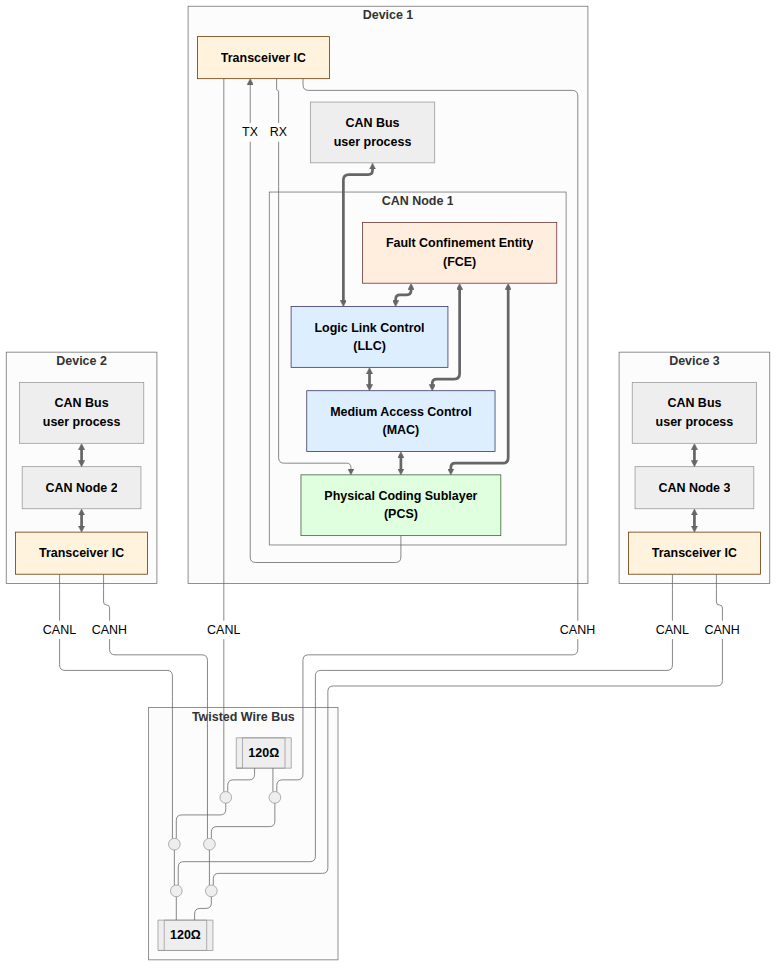
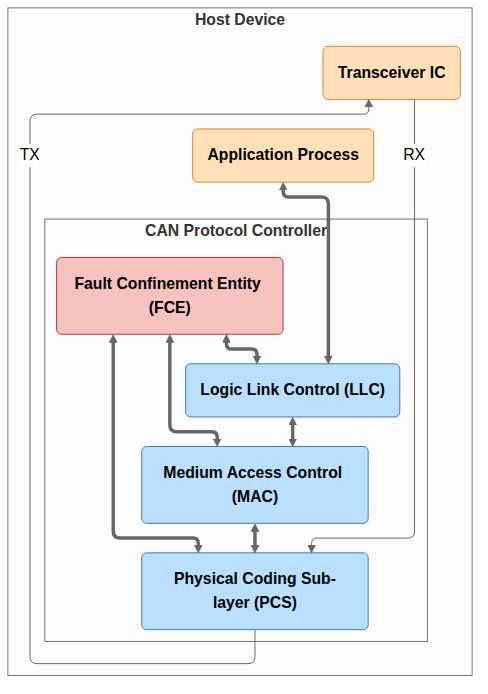
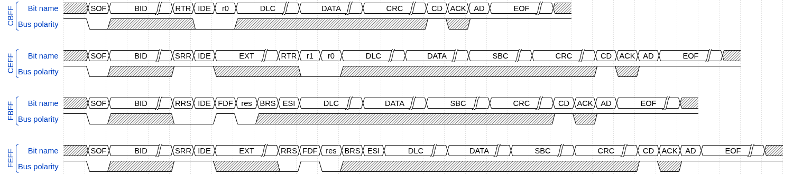
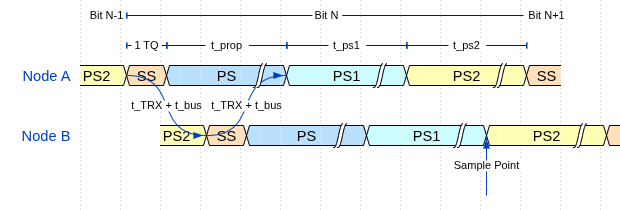
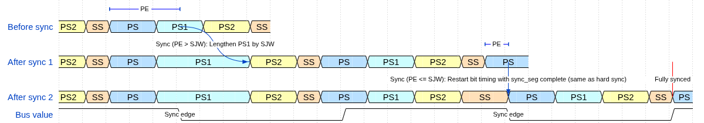
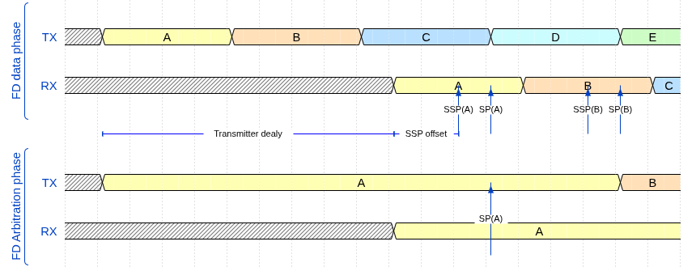
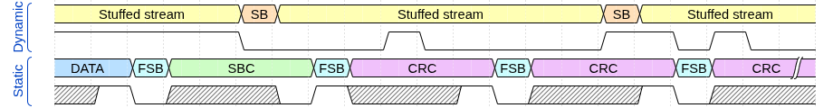
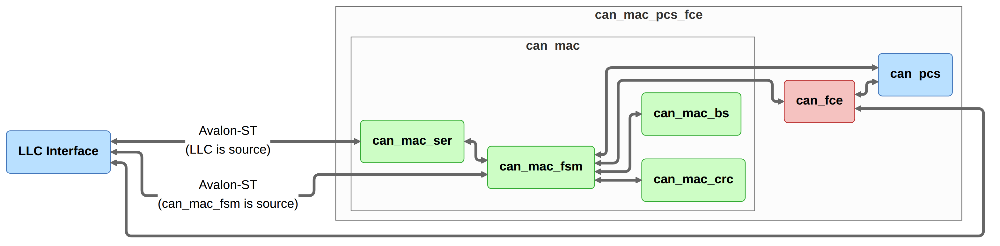
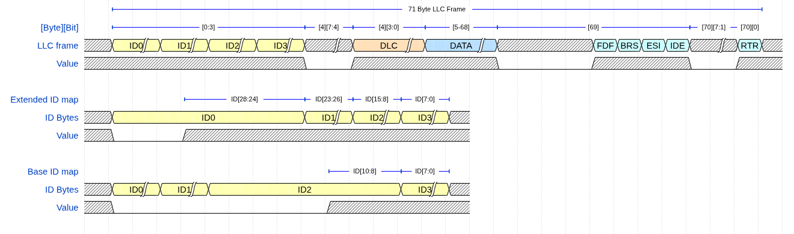

```{=latex}
\clearpage
```

# Approval {-}

This thesis was prepared at the Department of Applied Mathematics and Computer Science (DTU Compute), Technical University of Denmark, in partial fulfilment of the requirements for the degree of Bachelor of Science in Engineering. The work was carried out in collaboration with Everllence, where the controller is intended for use in high-reliability engine controller applications.

It is assumed that the reader has a working knowledge of digital logic design and binary communication protocols. Familiarity with VHDL or a similar hardware description language is an advantage but is not strictly required to follow the architectural and verification discussions.

```{=latex}
\vspace{2cm}
\begin{center}
\begin{minipage}{8cm}
\centering
\rule{7cm}{0.4pt}\\[4pt]
Mads Richardt (s224948)\\[2pt]
{\small Kgs.\ Lyngby, May 2026}
\end{minipage}
\end{center}
\clearpage
```

# Acknowledgements {-}

**Edward Alexandru Todirica**, Associate Professor, DTU Compute.
Thank you for supervision throughout the project and for valuable guidance on verification methodology and VHDL design practice.

**Fredrik Kristensen**, Everllence.
Thank you for framing the industrial requirements, providing access to the existing CAN controller as a reference, and for feedback on the design and implementation.

```{=latex}
\clearpage
\setcounter{tocdepth}{4}
\tableofcontents
\clearpage
```

# Abbreviations {-}

| Abbreviation | Meaning |
| :--- | ---: |
| ACK | Acknowledgment |
| AD | ACK Delimiter |
| AEF | Active Error Flag |
| AI | Artificial Intelligence |
| BRS | Bit Rate Switch |
| CAN | Controller Area Network |
| CANH | CAN High bus wire |
| CANL | CAN Low bus wire |
| CB | Classic Base (frame format) |
| CC | CAN Classic |
| CD | CRC Delimiter |
| CE | Classic Extended (frame format) |
| CRC | Cyclic Redundancy Check |
| DLC | Data Length Code |
| DMA | Direct Memory Access |
| DUT | Device Under Test |
| ED | Error Delimiter |
| EOF | End of Frame |
| ESI | Error State Indicator |
| FB | FD Base (frame format) |
| FCE | Fault Confinement Entity |
| FD | Flexible Data Rate |
| FDF | FD Frame bit |
| FE | FD Extended (frame format) |
| FPGA | Field-Programmable Gate Array |
| FSB | Fixed Stuff Bit |
| FSM | Finite State Machine |
| FTYP | Frame Type |
| HDL | Hardware Description Language |
| IDB | Identifier Base field (11-bit base ID) |
| IDE | Identifier Extension bit |
| IEXT | Identifier Extension field (18-bit extended ID) |
| IFS | Inter Frame Space |
| INT | Intermission |
| IP | Intellectual Property |
| ISO | International Organization for Standardization |
| LLC | Logical Link Control |
| LLM | Large Language Model |
| MAC | Medium Access Control |
| MIT | Massachusetts Institute of Technology (license) |
| MSB | Most Significant Bit |
| OD | Overload Delimiter |
| OF | Overload Flag |
| OSVVM | Open Source VHDL Verification Methodology |
| PCS | Physical Coding Sublayer |
| PE | Phase Error |
| PEF | Passive Error Flag |
| PS | Propagation Segment (PROP_SEG) |
| PS1 | Phase Segment 1 (PHASE_SEG1) |
| PS2 | Phase Segment 2 (PHASE_SEG2) |
| PSL | Property Specification Language |
| RRS | Reserved Remote Request Substitution bit (FD frames) |
| RTL | Register Transfer Level |
| RTR | Remote Transmission Request |
| RX | Receiver / Receive |
| SB | Stuff Bit |
| SBC | Stuff Bit Count |
| SJW | Synchronization Jump Width |
| SOF | Start of Frame |
| SP | Sample Point |
| SRR | Substitute Remote Request |
| SS | Sync Segment (SYNC_SEG) |
| SSP | Secondary Sample Point |
| ST | Suspend Transmission |
| TDC | Transmitter Delay Compensation |
| TEC/REC | Transmit Error Counter / Receive Error Counter |
| TQ | Time Quantum |
| TX | Transmitter / Transmit |
| VHDL | VHSIC Hardware Description Language |

: Abbreviations used in this report. {#tbl:abbreviations}

```{=latex}
\clearpage
\listoffigures
\clearpage
```

# Introduction {#sec:introduction}

Industrial control systems for large marine engines demand communication protocols that combine fault tolerance, multi-master arbitration, and multi-decade service reliability. The Controller Area Network has served that role at Everllence for the current generation of engine controllers, but as control system data requirements grow the bandwidth and payload limits of CAN Classic have become a bottleneck.

## Motivation {#sec:motivation}

Everllence (formerly MAN Energy Solutions) is a provider of propulsion and decarbonization solutions for the marine and energy industries, designing large two-stroke and four-stroke combustion engines for ship propulsion and power generation. This thesis was written within the engine controller division, where FPGA-based control hardware is developed and maintained for integration into Everllence's engine platforms.

The Controller Area Network (CAN) has been the workhorse of industrial control communication for decades, with fault-confinement properties that suit the reliability requirements of engine control applications. Everllence's existing CAN infrastructure is built around a CAN Classic protocol controller deployed on an IO-extender board forming part of the Triton motor controller system. As control systems grow more data-intensive, the eight-byte payload and 1 Mbit/s ceiling of CAN Classic has become a practical constraint. CAN FD extends the maximum payload to 64 bytes and raises the data-phase bit rate beyond 8 Mbit/s while preserving the CAN Classic arbitration and fault-confinement architecture - making it the natural migration path for Everllence's existing CAN infrastructure.

## Existing CAN Controller {#sec:existing-controller}

The starting point for this project is an existing CAN Classic controller developed internally at Everllence. The controller is implemented in VHDL and has been integrated into a production IO-extender FPGA design. It supports CAN Classic frames with both 11-bit (base) and 29-bit (extended) identifiers at bit rates up to 500 kbit/s, and has been verified through hardware bring-up on physical CAN buses.

The controller follows a monolithic architecture where a single top-level wrapper (`can_bus_controller`) instantiates six submodules: a combined TX/RX frame FSM (`can_fsm`), a bit timing generator (`can_node_clock`), a dynamic bit stuffer (`can_stuff_bit_gen`), a CRC-15 engine (`gen_crc`), and two Avalon-ST converters for frame serialization and deserialization (`can_ast_to_serial`, `can_serial_to_ast`). The entire design totals roughly 2,000 lines of VHDL across seven source files.

The central component is `can_fsm`, an 810-line FSM with 18 states that handles both transmission and reception in a single process. The FSM manages frame arbitration, bit-level transmission and reception, stuff-bit error checking, CRC validation, ACK handling, and error flag generation. Error counting (TEC/REC) and node state transitions (error active, error passive, bus off) are handled in separate processes within the same file but are tightly coupled to the main FSM through shared signals.

### Limitations {#sec:existing-limitations}

While the existing controller is functional for CAN Classic, several architectural limitations prevent it from being extended to support CAN FD:

**Single bit rate domain.** The `can_node_clock` module generates a single pair of timing strobes - one sample pulse and one transmit pulse - derived from a fixed set of bit timing parameters. CAN FD requires switching between a nominal bit rate (used during arbitration) and a faster data bit rate (used during the data phase), with Transmitter Delay Compensation (TDC) to account for the transceiver round-trip delay at the higher rate. Adding dual bit rate support and TDC to the existing clock module would require a fundamental redesign of the timing architecture.

**Dynamic bit stuffing only.** The `can_stuff_bit_gen` module implements the CAN Classic rule of inserting an inverse bit after five consecutive identical bits. CAN FD introduces a second stuffing mode - fixed bit stuffing - where a stuff bit is inserted at fixed intervals during the CRC field, and a Stuff Bit Count (SBC) field with Gray-coded parity is appended. The existing stuffer has no mechanism for mode switching or SBC generation.

**Single CRC polynomial.** The controller uses a single CRC-15 instance. CAN FD requires three CRC polynomials: CRC-15 for Classic frames, CRC-17 for FD frames with payloads up to 16 bytes, and CRC-21 for larger FD payloads. Furthermore, the CRC data feed differs between Classic and FD - in FD frames, dynamic stuff bits in the arbitration region are included in the CRC computation, requiring a dual data feed to the CRC engine.

**Combined TX/RX FSM.** The monolithic FSM interleaves transmission and reception logic in every state, with the `is_transmitter` flag selecting the active code path. This coupling makes it difficult to add FD-specific states (such as BRS, ESI, and the SBC field) without increasing the already high cyclomatic complexity. A CAN FD frame has more control fields than a Classic frame, and handling both TX and RX paths for all six frame variants (CB, CE, FB, FE data frames, plus remote frames for CB and CE) in a single process would result in an unwieldy FSM.

**Embedded error handling.** Error detection, error flag transmission, and error counter management are distributed across the main FSM process and its auxiliary processes. The ISO 11898-1 standard defines the Fault Confinement Entity (FCE) as a logically separate component with well-defined interfaces to the MAC and PCS sub-layers. Extracting the error handling into a reusable, independently testable FCE module - as required by the standard's layered architecture - would require significant refactoring of the existing FSM.

### Decision to Redesign {#sec:decision-to-redesign}

Given these limitations, extending the existing controller to CAN FD would require modifying nearly every submodule and fundamentally restructuring the FSM. The resulting design would carry the constraints of the original monolithic architecture while trying to support a significantly more complex protocol. Instead, a clean-slate redesign was chosen, structured around the ISO 11898-1 layered architecture (LLC, MAC, PCS, FCE) with reusable subcomponents (bit stuffer, CRC engine) and typed record interfaces.

## Existing CAN FD IP Cores {#sec:existing-ip-cores}

Before committing to an in-house redesign, the available CAN FD controller IP cores were evaluated. @tbl:canfd-ip-survey summarizes the candidates, spanning both open-source and commercial offerings.

### Open-Source Implementations {#sec:open-source-implementations}

**CTU CAN FD** [@ctucanfd][@jerabek2019] is the only mature open-source CAN FD controller available as synthesizable HDL. Developed at the Czech Technical University in Prague, it is written in VHDL, licensed under MIT, and has been conformance-tested against ISO 16845-1 [@iso16845_1]. The controller includes a full TX and RX pipeline with up to four TX buffers, acceptance filtering, timestamping, and a register interface with DMA support. A mainline Linux kernel driver has been available since kernel version 5.12. CTU CAN FD represents a complete, production-oriented CAN node - a significantly broader scope than what is needed in this project.

**OpenCores CAN** [@opencores_can] is a Verilog controller modeled after the Philips SJA1000 register interface. It is one of the earliest open-source CAN cores and is widely cited in academic work. However, it supports only CAN 2.0B (CAN Classic) and has seen no active development since approximately 2010. It cannot serve as a starting point for CAN FD.

**Canola** [@canola] is a VHDL CAN 2.0B controller with a clean VHDL-2008 codebase and a cocotb-based testbench. It includes a triple modular redundancy wrapper for radiation-tolerant applications. Like the OpenCores core, it does not support CAN FD.

### Commercial Implementations {#sec:commercial-implementations}

**Bosch M\_CAN** [@bosch_mcan][@hartwich2012] is the reference CAN FD controller, developed by the inventor of both CAN and CAN FD. M\_CAN is the IP core embedded in virtually every automotive microcontroller (NXP S32, Infineon AURIX, STM32, TI Jacinto, Renesas RH850). It is licensed under a non-disclosure agreement with per-design royalty fees.

**AMD/Xilinx CAN FD** [@xilinx_canfd] is a soft IP core included in the Vivado Design Suite. It provides an AXI4-Lite register interface with up to 32 acceptance filters, TX mailboxes, and RX FIFOs. It is device-locked to AMD/Xilinx FPGAs and cannot be ported to other targets.

**CAST CAN FD** [@cast_canfd] is a technology-independent RTL core with AMBA Advanced Peripheral Bus/Advanced High-performance Bus interface options. It is licensed per-design with an upfront fee. Synopsys (DesignWare) and Cadence offer similar application-specific integrated circuit-targeted CAN FD cores under their respective IP licensing programs.

| Implementation | Language | CAN FD | License | Scope | Conformance Tested |
|---|---|---|---|---|---|
| CTU CAN FD [@ctucanfd] | VHDL | Yes | MIT | Full node (TX+RX, buffers, DMA) | ISO 16845-1 |
| OpenCores CAN [@opencores_can] | Verilog | No | Lesser General Public License | Full node (CAN 2.0B only) | No |
| Canola [@canola] | VHDL | No | MIT | Full node (CAN 2.0B, triple modular redundancy) | No |
| Bosch M\_CAN [@bosch_mcan] | HDL (non-disclosure agreement) | Yes | Per-design royalty | Full node | Yes (reference) |
| AMD/Xilinx CAN FD [@xilinx_canfd] | HDL | Yes | Vivado-included | Full node | Yes |
| CAST CAN FD [@cast_canfd] | RTL | Yes | Per-design fee | Full node | Yes |

: Survey of available CAN FD controller IP cores. {#tbl:canfd-ip-survey}

### Rationale for In-House Development {#sec:rationale-in-house}

None of these solutions satisfies Everllence's combined requirements for safety-critical marine engine control.

**IP ownership and supply chain independence.** Everllence's engine controllers carry service commitments of up to thirty years. Commercial IP cores introduce a licensing dependency on an external vendor over that full horizon - vendors may discontinue support, change licensing terms, or be acquired. Owning the RTL outright eliminates this exposure and ensures that the design can be maintained, ported, and modified without third-party approval for the full product lifetime. The open-source CTU CAN FD avoids the licensing risk, but using it still means adopting a codebase whose architecture, naming conventions, and design decisions were made for a different context.

**Verification authority.** In safety-critical domains, the verification evidence must be traceable from standard requirements to RTL assertions and testbench results. Adopting a third-party core - even one conformance-tested against ISO 16845-1 - means inheriting its verification artifacts rather than producing them. Everllence's verification methodology requires full control over the verification plan, the testbench architecture, and the assertion coverage. Building the RTL in-house allows the verification plan (described in @sec:requirements-engineering) to drive the implementation, ensuring that every module is verified against the specific requirements extracted from the standard, using Everllence's own toolchain and conventions.

**Architectural scope.** All available IP cores implement a complete CAN node: TX and RX pipelines, message memory, acceptance filtering, buffer management, register interfaces, and in some cases DMA controllers. Everllence's application requires only the data link layer (LLC, MAC, PCS, FCE) - the protocol engine that converts between byte-level frame data and the serial bus. The higher-level buffering and filtering logic already exists in Everllence's FPGA infrastructure. Adopting a full-node IP core would introduce unnecessary complexity and area overhead, and the integration effort to bypass or disable the unused subsystems may approach the effort of a targeted implementation.

**Integration with existing infrastructure.** Everllence's FPGA designs use a specific Avalon-ST streaming interface for inter-module communication, a particular clock and reset architecture, and established conventions for signal naming and module boundaries. A third-party core would require an adaptation layer to bridge its native interface (Advanced eXtensible Interface, Advanced Peripheral Bus, or custom register map) to the existing infrastructure. The in-house design uses Everllence's interface conventions natively, eliminating this integration overhead.

**Platform independence.** The AMD/Xilinx CAN FD core is locked to Xilinx devices. The Bosch M\_CAN and other commercial cores are delivered as technology-specific netlists or encrypted RTL for a particular target. The in-house design is written in portable VHDL-2008, synthesizable on any FPGA platform or application-specific integrated circuit process flow, ensuring that the IP remains usable if Everllence changes FPGA vendors.

## Problem Statement {#sec:problem-statement}

The architectural limitations of the existing controller (@sec:existing-limitations) and the unsuitability of available third-party IP cores (@sec:rationale-in-house) together motivate a clean-slate CAN FD protocol controller conforming to ISO 11898-1.

## Objectives {#sec:objectives}

- Implement a CAN/CAN FD protocol controller in VHDL-2008, compliant with ISO 11898-1 [@iso11898_1] and supporting the CB, CE, FB, and FE frame formats.
- Structure the design around the ISO 11898-1 sub-layer model (LLC, MAC, PCS, FCE) to enable independent module-level verification.
- Implement dual bit rate switching and TDC for the FD data phase.
- Derive a structured, machine-readable verification plan from ISO 11898-1 normative requirements and demonstrate traceability from standard clauses to testbench results.
- Produce a portable, platform-independent design integrated via Avalon-ST interfaces into Everllence's existing FPGA infrastructure.

# Background {#sec:background}

The introduction established why a new CAN FD controller is needed at Everllence. Two bodies of knowledge bound the design choices that follow: the CAN and CAN FD protocol itself, and the VHDL-2008 and OSVVM toolchain in which it is implemented.

## CAN as a Communication Bus {#sec:can-as-bus}

The Controller Area Network (CAN) is a serial communication bus developed by Bosch in 1986 [@bosch1991] to connect electronic control units in automotive environments without a central host computer. Where point-to-point wiring and star-switched architectures require a dedicated conductor between every communicating pair, CAN uses a shared two-wire differential bus on which all nodes broadcast simultaneously and arbitrate access without any designated bus master. Any node may initiate a transmission at any time. Contention is resolved by a non-destructive bitwise arbitration in which the transmitter with the lower-priority identifier detects the collision and silently withdraws, leaving the winner's frame intact. Differential signaling on a twisted pair (ISO 11898-2 physical layer) provides strong common-mode noise rejection - a practical necessity in the electrically harsh environment of an engine bay or industrial cabinet (@fig:can_bus).

{#fig:can_bus width=60%}

CAN's error-handling architecture is a distinguishing feature relative to simpler serial protocols. Five complementary error detection mechanisms operate concurrently on every transmitted frame: bit monitoring, frame format checking, cyclic redundancy checking, acknowledgment checking, and bit stuffing violation detection. Charzinski showed that under a two-state channel model the residual error probability for an eight-byte frame in a ten-node network is bounded by approximately $3.5 \times 10^{-9} \cdot q_\text{bad}$ per frame, where $q_\text{bad}$ is the probability of a frame being transmitted during a bad channel period [@charzinski1994]. This figure is several orders of magnitude lower than contemporary automotive bus alternatives such as VAN and SCP evaluated under the same model [@charzinski1994]. A fault confinement mechanism tracks each node's error history and automatically escalates from error active through error passive to bus off, electrically isolating a persistently faulty node from the bus without disrupting communication between healthy nodes. Together these properties made CAN the protocol of choice for safety-relevant in-vehicle networks. Adoption subsequently spread to industrial automation, medical devices, and aerospace ground support equipment.

CAN's strengths are best understood in relation to the alternatives available to automotive system designers. @tbl:protocol-comparison summarizes the major bus protocols in the automotive domain. The Local Interconnect Network (LIN) is a single-wire, master-slave protocol reaching 20 kbit/s, used for cost-sensitive body peripherals such as window switches and seat actuators. LIN provides no fault confinement and no multi-master capability. FlexRay is a time-triggered bus operating at 10 Mbit/s with deterministic latency guarantees, designed for safety-critical X-by-wire applications. Its static time-division schedule requires centralized network configuration and carries substantial integration complexity, and the protocol provides no automatic fault confinement. Automotive Ethernet (100BASE-T1, 1000BASE-T1) delivers 100 Mbit/s to 1 Gbit/s and suits bandwidth-intensive applications such as camera feeds and over-the-air update payloads, but deterministic behavior requires Time-Sensitive Networking extensions and the protocol provides no native fault confinement for safety-critical control loops. CAN occupies a distinct position in this landscape: multi-master, event-driven, with native fault confinement, low wiring cost, and inherently robust against the electromagnetic interference typical of powertrain and industrial environments. For distributed control networks where bandwidth requirements are moderate and reliability is paramount, no alternative offers a comparable combination of properties.

| Protocol | Max bit rate | Multi-master | Fault confinement | Primary use |
|---|---|---|---|---|
| LIN | 20 kbit/s | No | No | Body peripherals |
| CAN Classic | 1 Mbit/s | Yes | Yes | Powertrain, chassis |
| CAN FD | ~8 Mbit/s (data phase) | Yes | Yes | Powertrain, chassis |
| FlexRay | 10 Mbit/s | No | No | X-by-wire |
| Automotive Ethernet | 1 Gbit/s | Yes | No | Infotainment, ADAS |

: Comparison of automotive communication protocols. {#tbl:protocol-comparison}

CAN's original data payload was capped at eight bytes per frame, limiting raw throughput to around 1 Mbit/s. As embedded control applications became more data-intensive, this ceiling became a practical constraint. CAN FD (Flexible Data Rate), introduced by Bosch in 2012 [@hartwich2012] and incorporated into ISO 11898-1 in 2015, extends the maximum payload to 64 bytes and introduces a separate higher-speed data phase with bit rates of 8 Mbit/s or beyond, while preserving the CAN Classic arbitration phase and the fault-confinement architecture unchanged. The bandwidth constraint imposed by arbitration - where signal propagation time between all nodes limits the bit rate - applies only during the arbitration phase when multiple nodes may simultaneously drive the bus. Once arbitration is resolved and a single transmitter controls the bus, the bit rate can be increased freely, limited only by transceiver slew rate and oscillator stability [@hartwich2012]. Hartwich demonstrated average data rates of 2.5 Mbit/s achievable with standard CAN transceivers, matching the effective payload of a low-speed FlexRay network [@hartwich2012]. At high data-phase bit rates the transceiver's TX-to-RX loop delay (up to 255 ns per ISO 11898-5) may exceed one bit time, requiring Transmitter Delay Compensation (TDC) to correctly position the secondary sample point used for bit-error monitoring. Mutter showed that for data-phase to arbitration-phase bit rate ratios below approximately 9, CAN FD accepts the same oscillator tolerance as CAN Classic, preserving compatibility with commodity crystal oscillators [@mutter2013].

CAN FD also strengthens the error detection architecture. The longer payloads require stronger CRC polynomials: a 17-bit BCH polynomial covers frames up to 16 data bytes and a 21-bit polynomial covers frames up to 64 bytes, both maintaining Hamming distance 6 [@hartwich2012]. A known weakness in CAN Classic, where two bit errors that generate and eliminate stuff conditions can pass undetected through the CRC [@charzinski1994], is addressed in CAN FD by including dynamic stuff bits in the CRC data feed and introducing the Stuff Bit Count (SBC) field. These improvements together reduce the residual error probability in the worst-case error class by several orders of magnitude compared to CAN Classic [@mutter2015]. The governing standard for this project is ISO 11898-1 [@iso11898_1], which specifies both CAN Classic and CAN FD data link layer and physical signaling requirements.

## VHDL-2008 and OSVVM {#sec:vhdl-osvvm}

The implementation language for this project is VHDL-2008, the current revision of the VHDL standard. VHDL-2008 adds several features relevant to parameterized hardware design and verification: unconstrained record elements, enhanced generic lists, and improved support for the VHDL numeric packages. The GHDL open-source simulator [@ghdl] supports VHDL-2008 natively and is used for all simulation in this project.

The verification framework is OSVVM (Open Source VHDL Verification Methodology) [@osvvm], a VHDL-native library providing test infrastructure including clock and reset generation, constrained-random stimulus, functional coverage, and a uniform pass/fail reporting framework. OSVVM procedures replace ad-hoc signal manipulation in testbenches, ensuring that timing relationships are expressed in terms of clock cycles rather than time literals and that pass/fail decisions are logged uniformly across all test scenarios.

# Requirements {#sec:requirements-engineering}

The introduction concluded that a clean-slate redesign is needed. This section establishes its scope: 38 requirements distilled from ISO 11898-1 normative obligations and the Everllence coding constraints that apply to all in-house FPGA modules.

## VHDL Code Standard and Design Constraints {#sec:engineering-constraints}

The constraints on this project come from two distinct sources. Two requirements are specific to this project's place within Everllence's existing CAN infrastructure while the remaining constraints come from Everllence's VHDL Code Standard and apply uniformly to all FPGA IP modules developed in-house.

### Project-specific Infrastructure Requirements

1. **Avalon-ST user interface:** The CAN controller's external interface to the host system must use the Avalon-ST streaming protocol [@avalon_st] (data, valid, ready, sop, eop). The requirement applies specifically to the boundary between the CAN controller and its user.
2. **IP library CRC block:** Everllence maintains a reusable, parameterised CRC generator (`gen_crc`) in its IP library. This module must be used for all CRC computations.

### File Structure and Naming

1. **Per-module file structure:** Each module must be organized into a fixed directory layout: `hdl_src/` for RTL source files, `hdl_tb/` for testbench files, and `test_case/` for waveform configuration. One entity per VHDL file, with the filename matching the entity name. Every entity requires a dedicated testbench, unless it is instantiated exclusively as a submodule of a fully tested parent.
2. **Entity port types:** Entity ports are restricted to `std_logic`, `std_logic_vector`, and records or arrays of these types. Modes are restricted to `in` and `out`.
3. **Naming conventions:** A mandatory prefix/suffix scheme applies to all VHDL identifiers: types (`t_`), constants (`c_`), generics (`gc_`), processes (`p_`), functions (`f_`), packages (`pk_`), state variables (`s_`), entity inputs (`_i`), and entity outputs (`_o`).

### RTL Coding Style and Verification

1. **RTL design rules:** Synchronous processes must be sensitive to the clock only. Reset must be synchronous and initialize all control registers. FSMs are preferably implemented as single-process designs where all signal assignments are derived from the current state, with an explicit other-state that returns to a known safe state.
2. **Testbench requirements:** Testbenches must follow a black-box testing model and test cases must be ordered as: reset tests first, then a normal-usage test, then all remaining tests.

## From Specification to Structured Requirements {#sec:req-extraction}

The requirements engineering process was aimed at tackling two key objectives [@bergeron2003ch3]:

1. Extracting a clear and actionable set of requirements that could serve as a starting point for the design phase.
2. Establishing a clear, traceable link between the ISO 11898-1 specification and the verification environment.

Both objectives are complicated by the source material: normative requirements are distributed across subsections, often restated from different perspectives, and interspersed with explanatory text. The standard compounds this by bundling multiple obligations into single clauses, interspersing normative `shall` statements with informative rationale prose, and repeating equivalent obligations from both transmitter and receiver perspectives.

The requirements set was constructed using the AI-assisted pipeline shown in @fig:ver_plan_pipeline. The first step was converting the ISO 11898-1 pdf to Markdown - a format which can be efficiently searched and ingested by LLM models. The resulting Markdown file was then fed to a Claude Sonnet 4.6 LLM agent, which was prompted to extract all normative statements - sentences containing words like "shall", "should", "must", and their corresponding negations.

{#fig:ver_plan_pipeline width=100%}

This process yielded a raw set of 168 normative statements linked to the ISO standard sections from which they were extracted. The normative set was then manually reviewed, consolidated, and distilled into a final set of 38 requirements (reproduced in @sec:appendix-vplan).

The requirements set is stored as a configuration file (`verification_plan.toml`), one `[[requirement]]` block per entry. To support ongoing AI-assisted refinement without the risk of silent data corruption, a custom Model Context Protocol server (`verification_plan_manager.py`) was developed alongside the plan. The server exposes query, update, insert, and statistics operations as tool calls that the AI coding agent can invoke directly within its development environment. Each write operation targets a single requirement entry and validates field values against the schema before committing. This makes it structurally impossible for the agent to silently drop entries, fabricate field values, or corrupt the file syntax - failure modes that arise inevitably when an LLM is asked to rewrite a large structured file in one operation. During the requirements phase, the agent worked exclusively with the five fields relevant at this stage:

- **`source_clause`**: The ISO 11898-1 section reference (e.g. §6.6.13.1). This is the traceability anchor - every requirement links back to the clause from which it was distilled, making it possible to verify the requirements set against the standard during review.
- **`original_wording`**: Verbatim ISO text for the relevant clauses. Preserving the source wording prevents paraphrase drift and provides a fallback for resolving ambiguity during implementation.
- **`paraphrase`**: A concise, implementer-facing restatement of the requirement. Where the ISO prose bundles multiple obligations into a single clause, the paraphrase enumerates them as numbered sub-claims, each independently verifiable.
- **`priority`**: A three-level rating - P1 (need-to-have, derived from "shall" obligations and core correctness), P2 (verified in the normal cycle), or P3 (optional, derived from "should" clauses or implementation-dependent features). Priority drives implementation sequencing and scope decisions when schedule is constrained. Of the 38 requirements, 31 are rated P1, five are P2, and two are P3. Every requirement not rated P1 was explicitly demoted. The rationale for each demotion is given in @tbl:priority-demotion.
- **`notes`**: Residual clarifications not resolved by the paraphrase - implementation constraints, out-of-scope markers, or known ambiguities flagged for design review.

| ID | Topic | Priority | Demotion rationale |
| :- | :---- | :- | :------------------------------------------------------------------------- |
| REQ-002 | LLC TX request and abort timing | P2 | The 2-SOF processing window is a responsiveness guarantee, not a correctness constraint. A node that transmits eventually but outside this window sends valid frames. |
| REQ-011 | Remote frame | P2 | A data-only node is a valid CAN implementation. Remote frame support is a distinct feature subset not required for basic interoperability. |
| REQ-016 | ESI bit transmission | P2 | ESI communicates the node's error state as an informational signal. Incorrect ESI does not abort a frame or trigger a protocol error at any receiver. |
| REQ-036 | MAC data consistency | P2 | A frame corrupted mid-transmission would be error-flagged by other nodes on the bus and retransmitted. The requirement reduces bus pollution from invalid frames but the node remains functional without it. |
| REQ-037 | Error signaling enable | P2 | Error signaling itself is covered by P1 requirements. This requirement concerns only the existence of a configurable disable mode, which is an optional operational feature. |
| REQ-004 | Frame acceptance filtering | P3 | ISO uses advisory "should" language. Acceptance filtering is also an application-layer concern above the LLC boundary verified here. |
| REQ-038 | DLC padding | P3 | Padding with 0xCC applies only when the implementation exposes a configurable maximum-data-byte restriction. The feature may be waived entirely if that restriction is not implemented. |

: Priority demotion rationale for all requirements not rated P1. {#tbl:priority-demotion}

## AI-Assisted Extraction: Utility and Limitations {#sec:ai-extraction}

The AI-assisted workflow delivered value in two distinct phases of the project, with very different characteristics in each.

In the extraction phase, the LLM agent earned its keep by bootstrapping and linking the initial normative statement set. Having a fully populated and linked starting point - even one requiring substantial revision - gave the manual review process a concrete artifact to work from. The time saving from the extraction itself was, however, marginal. The agent's output had to be reviewed statement by statement, which is functionally similar to extracting requirements manually in the first place. The primary benefit of the AI-assisted approach in this phase was therefore not efficiency, but rather the increased consistency of an automated pass over the full standard text.

The distillation step that followed - consolidating 168 raw normative statements into 38 prioritized, independently verifiable requirements - required substantial manual effort that the AI could not replace. Deciding which statements address the same underlying obligation, how to bound each requirement so that it is independently verifiable, and how to assign priority in a way that is defensible against the standard text are judgment calls that depend on understanding the protocol at an implementation level.

The MCP server interface proved genuinely useful throughout the design, implementation, and verification phases that followed extraction. As implementation decisions were made, requirements were refined - paraphrases sharpened, notes extended, observability classifications updated, and traceability fields populated. The AI coding agent performed these updates directly through the MCP tool calls, targeting individual requirement fields against a schema-validated store. The alternative - asking an agent to rewrite the full TOML file each time a requirement changed - would have introduced silent data corruption risks at every edit. The narrow, validated write interface made incremental AI-assisted maintenance of the verification plan safe and practical across all three project phases.

The 38 requirements, each linked to its ISO source clause and assigned a priority, define the scope of what must be implemented and verified. They also function as a structured map to the protocol: every requirement points to a mechanism that must be understood before implementation can begin. The following section provides that understanding - covering the sub-layer model, frame formats, bit timing, bit stuffing, CRC, and error handling.

# CAN and CAN FD Protocol Overview {#sec:can-protocol-overview}

Each requirement in @sec:requirements-engineering refers to a specific protocol mechanism. This section covers those mechanisms - the sub-layer model, frame formats, bit timing, stuffing, CRC, and error handling - with each cross-referenced to the relevant REQ-NNN entries. Readers familiar with ISO 11898-1 may skip to @sec:verification-plan.

## Layered Reference Model {#sec:can-layered-model}

{#fig:can-node width=100%}

ISO 11898-1 structures the CAN data link layer into three functional sub-layers and a cross-cutting Fault Confinement Entity (FCE) (@fig:can-node):

- **LLC (Logical Link Control)**: accepts frame requests from the host application, applies retransmission policy on error or lost arbitration, and supplies frames to the MAC in serialized form.
- **MAC (Medium Access Control)**: encodes and decodes the frame bit-by-bit - performing bit stuffing and destuffing, CRC generation and checking, and acknowledgment handling - and governs bus access arbitration.
- **PCS (Physical Coding Sublayer)**: manages bit timing, clock synchronization (including Transmitter Delay Compensation for FD data phase), and the sample/drive interface to the physical transceiver.
- **FCE (Fault Confinement Entity)**: maintains Transmit Error Counter (TEC) and Receive Error Counter (REC), escalating the node's error state from error active through error passive to bus off as error counts accumulate.

In the implementation described in this report, each sub-layer maps to a dedicated VHDL module, and the sub-layer interfaces become the port records connecting those modules (@sec:design-architecture). LLC service obligations are captured in REQ-001 through REQ-005 and REQ-033. MAC frame-encoding rules are in REQ-006 through REQ-024 and REQ-032 through REQ-038. PCS timing constraints are in REQ-025 through REQ-028. FCE counter and state-transition rules are in REQ-029 through REQ-031 and REQ-037.

## Frame Types and Formats {#sec:frame-types}

CAN defines two classes of frames: CAN Classic (CC) and CAN FD (FD). Within each class, frames may carry either an 11-bit base identifier or a 29-bit extended identifier, giving four frame formats: CB (Classic Base), CE (Classic Extended), FB (FD Base), and FE (FD Extended), as shown in @fig:can-frame-structure. Classic frames (CB and CE) additionally support remote frame variants (RTR=1, no data field), giving six bus frame types in total. CAN XL frames are out of scope for this project.

A CAN Classic frame consists of Start of Frame (SOF), Arbitration field (identifier, RTR, IDE), Control field (DLC), Data field, CRC field, ACK slot and delimiter, End of Frame (EOF), and Intermission. SOF is a single dominant bit that marks the beginning of a frame and triggers hard synchronization in all receiving nodes (REQ-010). Within the arbitration field, bits are transmitted MSB first (REQ-034). The RTR bit distinguishes data frames from remote frames, being dominant for data frames and recessive for remote frames (REQ-011). In extended frames, an SRR placeholder bit transmitted recessive precedes the IDE bit (REQ-012). The DLC encodes the number of data bytes using the four-bit mapping defined in ISO 11898-1 (REQ-033, REQ-038). After the data and CRC fields, the ACK slot carries a dominant bit driven by every receiver that has successfully validated the frame CRC - the transmitter monitors this slot and reports an acknowledgment error if no dominant bit is received (REQ-014). The frame is delimited by seven recessive EOF bits followed by three recessive intermission bits (REQ-020, REQ-008).

A CAN FD frame shares the same structure through the arbitration phase and then introduces FD-specific control fields. The FDF bit distinguishes an FD frame from a Classic frame. A recessive FDF triggers the FD control field sequence including reserved bits, BRS, and ESI (REQ-015). The BRS (Bit Rate Switch) bit controls the transition to the data-phase bit rate: when BRS is recessive the bus switches to the faster data rate immediately after the BRS sample point and returns to the nominal rate at the CRC delimiter (REQ-032). The ESI (Error State Indicator) bit reflects the transmitting node's fault-confinement state: a node in error passive state shall transmit ESI recessive (REQ-016).

{#fig:can-frame-structure height=95%}

## Bit Timing and Flexible Data Rate {#sec:bit-timing}

{#fig:can-bit-timing width=100%}

Every CAN bit period is divided into four non-overlapping time segments measured in Time Quanta (TQ), where one TQ equals the period of the prescaled system clock (@fig:can-bit-timing). CAN FD extends CAN Classic with an independently configured data-phase bit rate. A CAN FD node therefore maintains two independent sets of segment parameters, one for the nominal rate and one for the data rate (REQ-025):

- **Sync Segment (SYNC_SEG)**: one TQ. The point at which the bus is expected to produce a recessive-to-dominant edge after synchronization.
- **Propagation Segment (PROP_SEG)**: compensates for round-trip signal propagation delay on the bus and in the transceiver. It shall be programmed to be at least as long as twice the maximum bus propagation delay.
- **Phase Segment 1 (PHASE_SEG1)**: immediately precedes the sample point. Can be lengthened by the resynchronization mechanism to absorb positive phase errors.
- **Phase Segment 2 (PHASE_SEG2)**: follows the sample point to the end of the bit. Can be shortened to absorb negative phase errors.

The **sample point** falls at the PHASE_SEG1 / PHASE_SEG2 boundary. Every receiver samples the bus exactly once per bit at this point. The sample point position - expressed as a percentage of the total bit time - is a configuration parameter traded off against bus length, node count, and oscillator tolerance.

**Resynchronization** corrects for accumulated phase error between a receiver's local oscillator and the transmitter's bus edges. Hard synchronization forces a full re-alignment on the SOF falling edge at the start of each frame. During the frame, resynchronization adjusts PHASE_SEG1 or PHASE_SEG2 by up to the configured Synchronization Jump Width (SJW) on each recessive-to-dominant edge, keeping the sample point aligned with the transmitter. Only one synchronization is permitted within a single bit time (REQ-027). The two resynchronization cases are illustrated in @fig:can-sync.

{#fig:can-sync width=100%}

**CAN FD and the flexible data rate.** CAN FD introduces a second, independently configured bit rate for the data phase. The BRS (Bit Rate Switch) bit in the FD control field (@fig:can-frame-structure) controls this transition: when BRS is recessive, the bus switches to the data-phase bit rate immediately after the BRS sample point and returns to the nominal rate at the CRC delimiter. The nominal rate governs the arbitration phase (SOF through BRS) and the return path (CRC delimiter onward). The data rate governs the payload and CRC fields in between. Because the data phase operates at a much shorter bit time, the same physical propagation delay represents a larger fraction of the bit period. On electrically long buses at high data rates, the loop propagation delay can exceed a full data-phase bit time.

**Transmitter Delay Compensation (TDC)** addresses this. A transmitter in the FD data phase cannot rely on immediate bus loopback for bit-error monitoring, because the echo of a driven bit arrives one or more bit times late. TDC measures the actual round-trip delay at the start of the data phase and configures a Secondary Sample Point (SSP) at the correct offset, so that each transmitted bit is still checked for loopback correctness. The TDC measurement and SSP configuration are PCS responsibilities and are a significant driver of PCS complexity in the implementation (@sec:impl-can-pcs, @fig:can-tdc).

{#fig:can-tdc width=100%}


## Bit Stuffing {#sec:bit-stuffing}

Bit stuffing ensures sufficient transitions on the bus for receiver clock synchronization. CAN Classic applies dynamic stuffing throughout the frame: after five consecutive bits of the same polarity, the transmitter inserts one complement stuff bit and the receiver removes it before forwarding the data stream (REQ-019). CAN FD retains dynamic stuffing through the arbitration phase, then switches to a combined dynamic-plus-fixed scheme in the data phase. Fixed stuff bits are inserted at predetermined positions (every fourth bit in the CRC field, independent of the preceding bit pattern). They carry a parity-encoded Stuff Bit Count (SBC) field that allows receivers to independently verify the number of dynamic stuff bits seen in the frame - an additional error detection layer absent in CAN Classic (REQ-017, @fig:can-bit-stuffing).

{#fig:can-bit-stuffing width=100%}

## Cyclic Redundancy Check {#sec:crc-overview}

The CRC polynomial and field length depend on frame type and data payload length (REQ-006):

- **CRC-15**: used for all CAN Classic frames. Dynamic stuff bits are excluded from the CC CRC computation - the CRC accumulates over the destuffed bit stream from SOF through the end of the data field (REQ-013).
- **CRC-17**: used for FD frames with data payloads up to 16 bytes (DLC 0-10).
- **CRC-21**: used for FD frames with data payloads from 20 to 64 bytes (DLC 11-15).

A key asymmetry between CC and FD concerns the CRC data feed. For CC frames, dynamic stuff bits are excluded from the CRC computation (REQ-013). For FD frames, dynamic stuff bits within the arbitration region are included, while fixed stuff bits in the FD CRC region are also included. This dual data-feed requirement is a direct consequence of REQ-013 and has concrete consequences for the MAC implementation described in @sec:impl-can-mac-crc. The CRC field is terminated by a recessive CRC delimiter bit (REQ-018). A received frame with a CRC mismatch causes the detecting node to transmit an error flag.

## Error Detection and Fault Confinement {#sec:error-model}

Every CAN node monitors the bus for five categories of error (REQ-022). Bit errors occur when a transmitter reads back a polarity different from what it drove. Stuff errors occur when six consecutive bits of the same polarity appear where the stuffing rule prohibits it. CRC errors occur when the received checksum does not match the locally recomputed value. Form errors occur when fixed-format fields contain illegal bit values. Acknowledgment errors occur when a transmitter receives no dominant ACK bit from any receiver (REQ-014). Detection of any of these errors causes the detecting node to immediately transmit an error flag, aborting the in-progress frame (REQ-023). An error active node transmits an active error flag consisting of six consecutive dominant bits. An error passive node transmits a passive flag of six consecutive recessive bits instead (REQ-007). Both are followed by an eight-bit recessive error delimiter.

The FCE tracks each node's error history through TEC and REC. Counter increments and decrements follow the rules in ISO 11898-1 sec. 8.1.4.2 (REQ-030). A node begins in error active and transitions to error passive when either counter exceeds 127 (REQ-031), then to bus off when TEC exceeds 255. In bus off the node ceases all bus activity and shall not influence the bus (REQ-028) until 128 sequences of 11 consecutive recessive bits are observed, after which TEC and REC are reset and the node returns to error active. A host-initiated `llc_i.normal_mode` assertion also resets the FCE to its initial state immediately (REQ-029). Whether error signaling is enabled at all is a run-time configuration parameter (REQ-037). This escalation mechanism is the subject of several verification plan requirements and directly motivates the separation of the FCE into a dedicated module with its own testbench.

With those mechanisms established - sub-layer boundaries, frame formats, bit timing and the dual data rate, stuffing rules, CRC polynomials, and the fault confinement escalation model - @sec:verification-plan introduces the five classification dimensions of the verification plan and shows how each one connects back to the protocol concepts described here.

# Verification Plan {#sec:verification-plan}

The requirements set established what must be true about the implementation - 38 entries, each naming a protocol obligation and linking it to its ISO clause. But requirements in that form are not yet actionable as verification tasks: they say nothing about which module testbench should exercise them, what stimulus configurations are needed, whether internal signals must be observable, or how completion will be recognized. Turning the requirements set into a verification plan means answering those questions explicitly for each entry, before implementation begins.

The plan was populated through the same Model Context Protocol server introduced in @sec:requirements-engineering, which validated each field value against the schema before committing. The five classification dimensions fall into two groups. Three are design-facing - `layer`, `side`, and `format_applicability` - determining where each requirement belongs in the module decomposition and what stimulus configurations its testbench needs. Two are verification-facing - `observability` and `verification_method` - resolving whether a requirement can be checked through port signals or requires access to internal state, and specifying the verification technique. Priority spans both groups, driving implementation sequencing and determining which requirements must be closed before the design is considered complete. The dimensions are:

- `layer`, @sec:vplan-layer
- `side`, @sec:vplan-side
- `format_applicability`, @sec:vplan-format
- `observability`, @sec:vplan-observability
- `priority`, @sec:vplan-priority

The following subsections describe the rationale and allowed values for each dimension, followed by the full verification plan data structure and its traceability fields.


## Layer {#sec:vplan-layer}

The layer field assigns each requirement to the protocol sub-layer that owns it (LLC, MAC, PCS, or FCE - see @sec:can-layered-model), determining the verification boundary at which the requirement must be exercised. A fifth label - **system** - classifies requirements that are inherently multi-layer or multi-node in character. Some CAN behaviors cannot be attributed to a single layer of a single node: they emerge from interactions between multiple nodes on the bus, or span the layer boundary within a single node. The system label flags these requirements as ones that require either an integrated multi-module testbench or a multi-node simulation environment.

At design time, this classification directly motivated the layered module architecture: requirements assigned to a given layer pointed to the corresponding module as the responsible implementation unit and to that module's testbench as the primary verification environment. The consequence of the system label is described further in @sec:combined-vs-separated-fsm.

## Side {#sec:vplan-side}

The side field records whether a requirement pertains to the transmitter path, the receiver path, or both roles simultaneously. This dimension reflects the ISO standard's own framing, which frequently specifies transmitter and receiver obligations separately. In the verification environment, the side field determines whether a testbench drives the DUT in transmitter mode, receiver mode, or both roles in succession within a single test scenario. The design consequences of this dimension - and why it appeared to motivate a split-path architecture but did not - are discussed in @sec:combined-vs-separated-fsm.

## Format Applicability {#sec:vplan-format}

The format_applicability field records which of the in-scope frame formats (CB, CE, FB, FE - see @fig:can-frame-structure, where CB and CE implicitly cover remote frame variants) each requirement applies to. Because the formats differ in stuffing mode, CRC polynomial, and control field structure (@sec:can-protocol-overview), a requirement that applies only to FD frames implies stimulus configurations with FDF=1 and DLC values spanning both the CRC-17 and CRC-21 threshold, while a requirement that applies to all four formats must be exercised across all format-specific configurations. The field makes those implications explicit rather than leaving them to be inferred from the requirement text.

## Observability {#sec:vplan-observability}

The observability field resolves each requirement as either black-box or white-box, relative to the module boundary of the owning layer:

- **Black-box**: Can be verified purely through the module's observable port signals.
- **White-box**: Verification requires direct observation of the module's internal state.

This distinction has direct consequences for testbench architecture. Black-box requirements are verifiable with stimulus-and-observe testbenches that drive inputs and check outputs without any knowledge of internal implementation. White-box requirements - which include CRC polynomial correctness, bit counter arithmetic, error counter thresholds, and Gray-coded SBC encoding - require either PSL assertions on internal signals or a parallel reference model that re-computes the expected value independently. In the verification plan, white-box requirements are the primary driver for embedding PSL assertions directly in the RTL source files, where they have access to internal signals regardless of module hierarchy.

## Priority {#sec:vplan-priority}

The priority field classifies each requirement into one of three levels:

- P1 requirements are need-to-have - they must be verified before the design can be considered complete.
- P2 requirements are nice-to-have - they are verified in the normal verification cycle but do not block closure.
- P3 requirements are optional - addressed only if schedule permits.

The final plan contains 31 P1, five P2, and two P3 requirements. The demotion rationale for each requirement not rated P1 is given in @tbl:priority-demotion. The plan is considered closed when all P1 requirements reach `complete` status. P2 and P3 requirements are addressed as schedule permits.

## Requirement Distribution {#sec:vplan-distribution}

@tbl:vplan-distribution shows the 38 requirements distributed across layer and observability. MAC dominates both in count and in white-box density, reflecting the breadth of frame-encoding logic that must be verified against internal bit-level state. FCE requirements are entirely black-box: fault-confinement state transitions are fully observable through the node's error-state output signals without needing access to internal counters. System requirements - those that require a multi-node or multi-module environment - split roughly evenly between the two observability classes.

| Layer | Black-box | White-box | Total |
| :---- | --------: | --------: | ----: |
| MAC | 3 | 16 | 19 |
| LLC | 4 | 3 | 7 |
| System | 2 | 3 | 5 |
| PCS | 1 | 3 | 4 |
| FCE | 3 | 0 | 3 |
| **Total** | **13** | **25** | **38** |

: Requirement distribution by layer and observability. {#tbl:vplan-distribution}

## Verification Plan Data Structure {#sec:verification-plan-data-structure}

The verification plan data structure (@tbl:vplan-metadata-fields) augments each requirement with the dimensions needed to answer not just *what* must be true, but *how* it will be verified, *where* the evidence lives, and *when* verification is complete. The plan evolved continuously as implementation and verification work progressed. Two dimensions were not part of the initial taxonomy: the `system` layer label was added when it became clear that some CAN behaviors emerge from multi-node interactions and cannot be attributed to any single module's testbench. The `observability` field was introduced when the distinction between black-box and white-box verification had direct consequences for testbench architecture that were not apparent from the requirement text alone. The following sub-sections detail the rationale and allowed values for each field in the verification plan. The complete verification plan is reproduced in @sec:appendix-vplan as two separate tables (linked by common IDs).


| Field | Purpose |
| :--- | :--- |
| `id` | Sequential identifier REQ-NNN. |
| `source_clause` | ISO 11898-1:2024 section reference. |
| `original_wording` | Verbatim normative text excerpts from the ISO standard.|
| `paraphrase` | Concise paraphrase of the `original_wording` field (this is the actual requirement) |
| `layer` | Sub-layer owner: LLC, MAC, PCS, FCE, or system (@sec:vplan-layer). |
| `side` |  transmitter, receiver, or both (@sec:vplan-side). |
| `format_applicability` | Applicable frame formats: CB, CE, FB, FE (@sec:vplan-format). |
| `observability` | `black_box` or `white_box` (@sec:vplan-observability). |
| `verification_method` | Method(s) used to verify the requirement (@sec:vplan-method). |
| `priority` | P1 (need-to-have), P2 (nice-to-have), or P3 (optional) (@sec:vplan-priority). |
| `status` | `not_started`, `in_progress` or `complete` (@sec:vplan-status). |
| `notes` | The field is intended to clarify residual ambiguity left over from the other fields |
| `label` | Assertion label, TB procedure name, coverage ID, or RTL tag. Comma-separated when multiple procedures cover distinct sub-claims (@sec:vplan-traceability). |
| `file` | Target file: TB for simulation/coverage, RTL for code inspection. Comma-separated when sub-claims span multiple files (@sec:vplan-traceability). |

: Verification-plan data structure fields. {#tbl:vplan-metadata-fields}

### Verification Method {#sec:vplan-method}

The verification_method field makes the path from requirement to verification artifact explicit and actionable. Four methods are used: `simulation` (automated assertion procedures in a testbench), `code_inspection`  (RTL source review), `waveform_inspection` (manual review of simulation output), and `coverage` (a functional coverage bin that records whether a specific condition or value range was exercised during simulation). Combinations are valid when multiple sub-claims within one requirement each call for a different method.


### Traceability: Label and File {#sec:vplan-traceability}

Each requirement entry carries two dedicated traceability fields: a `file` field identifying the testbench or RTL source file responsible for covering the requirement, and a `label` field identifying a specific named procedure, assertion, or coverage ID within that file. Together they establish a direct, navigable link from each requirement to its verification artifact.

### Status {#sec:vplan-status}

The status field (`not_started`, `in_progress`, `complete`) records requirement closure state explicitly, allowing partial progress to be tracked.

The verification plan - 38 requirements each classified along five dimensions and each linked to a testbench file and assertion label - served both roles in what followed. The design-facing dimensions (layer, side, format_applicability) constituted the primary architectural inputs for the design phase, mapping requirements to module boundaries and implementation scope. The verification-facing dimensions (observability, verification_method, label, file) defined the testbench architecture and evidence type for each requirement. How the design-facing dimensions shaped the module decomposition - and where the apparent mapping from requirements structure to design structure broke down - is the subject of @sec:design-architecture.

# Design and Architecture {#sec:design-architecture}

The verification plan classified all 38 requirements along three design-facing dimensions: `layer`, `side`, and `format_applicability`. Two led directly to sound architectural choices. One pointed toward a split TX/RX architecture that was attempted, found unworkable, and replaced by the unified `can_mac_fsm`. This section traces those effects and describes the resulting module decomposition.

## Ramifications of the Requirements Model on Initial Design Strategy {#sec:req-design-ramifications}

The structure of the requirements model had direct consequences for the initial design strategy, in ways that were not fully anticipated at the outset.

The **layer dimension** mapped naturally onto the ISO standard's own layered reference model, making a layered module architecture the obvious implementation strategy. A dedicated hardware module for each layer - MAC, LLC, fault confinement, and PCS - would allow requirements pertaining to a given layer to be verified in isolation. The observability dimension reinforced this directly: black-box requirements mapped cleanly onto port-level stimulus and observation, while white-box requirements pointed toward the need for reference models or PSL assertions on internal signals, both of which are most tractable in a per-module testbench. This was a sound conclusion: the modular architecture proved to be the right design choice.

The **TX/RX side dimension** had a subtler and more consequential effect. Organizing requirements along the transmitter/receiver axis made intuitive sense from a specification perspective - the ISO standard itself frames many requirements in terms of transmitter behavior and receiver behavior - and it was genuinely useful for thinking through which requirements belonged where. However, it also made a split-path implementation architecture look like the natural design strategy, simply because the requirements were literally organized along that split. The implication appeared to be: implement a TX module, implement an RX module, and map the TX requirements to the former and the RX requirements to the latter.

This turned out to be a red herring. The pitfalls of the split-path approach were not at all apparent from the requirements table alone. The table made the split architecture look clean and well-motivated. The problems - design drift between separately implemented FSMs, integration complexity, and unnecessary hardware duplication - only surfaced later, during integration. The structure of a requirements model can inadvertently bias architectural decisions in ways that are not immediately obvious, and the apparent naturalness of a design strategy that mirrors the requirements structure is not in itself a reliable signal that the strategy is sound.

The **format_applicability dimension** had a more constructive effect. Requirements tagged with a specific format subset (CB, CE, FB, FE, or combinations) made explicit which frame variants each protocol mechanism must handle, which in turn shaped two concrete design decisions. First, the MAC FSM needed per-field state granularity rather than per-phase granularity: because different format subsets diverge at specific field boundaries (the IDE/FDF/RES sequence differs between Classic and FD, and between base and extended addressing), encoding those branches in per-field states keeps each state's logic narrow and format-specific transitions visible in the state graph. Second, the LLC-to-MAC streaming interface needed a front-loaded metadata layout - all format flags available before the first ID bit is needed - so that the MAC FSM could determine its branch path without buffering the entire frame. Both decisions are detailed in @sec:per-field-vs-per-phase and @sec:internal-llc-frame-format respectively.

## Architectural Design Decisions {#sec:architectural-design-decisions}

The ramifications identified above narrowed the design space early: a layered architecture was well-motivated by the requirements model, and a unified FSM proved necessary once the split-path approach was attempted. The primary inputs were the existing in-house CAN Classic controller (@sec:existing-controller) and the ISO 11898-1 standard's own layered reference model [@iso11898_1]. CTU CAN FD [@ctucanfd][@jerabek2019] is noted as an existing open-source CAN FD implementation but was not studied in detail.

### Monolithic vs. Layered Architecture {#sec:monolithic-vs-layered}

The existing controller uses a flat architecture: a single FSM (`can_fsm`, 810 lines) directly drives the bus output, reads the bus input, manages bit counting, handles stuff-bit insertion, coordinates CRC computation, and updates error counters - all in one clocked process. This approach minimizes inter-module latency and signal fanout, since every decision is made in a single combinational cone. For CAN Classic, where the frame has at most two format variants (base and extended) and a single bit rate, the complexity is manageable.

CAN FD, however, introduces six bus frame variants (CB, CE, FB, FE data frames, plus remote frames for CB and CE), dual bit rates, fixed bit stuffing with SBC encoding, three CRC polynomials, and a richer error model. Extending the monolithic FSM to cover these features would require nested conditionals on the format type in nearly every state, increasing the cyclomatic complexity well beyond what is practical to verify or maintain. The existing controller's `s_arbitration` state already contains 70 lines of interleaved TX/RX logic for two frame formats. Scaling this to six variants with additional control fields (BRS, ESI, SBC) and remote frame handling would roughly triple the state's complexity.

The alternative - and the approach adopted - is to follow the ISO 11898-1 reference model, which decomposes the data link layer into LLC, MAC, and PCS sub-layers with a separate FCE. Each sub-layer has a well-defined service interface (described in @sec:system-overview), and each can be implemented and verified independently. This decomposition introduces inter-module interfaces and pipeline latency, but it confines format-specific complexity to the module where it belongs: the MAC FSM handles frame field sequencing, the bit stuffer handles stuff-bit insertion and SBC generation, and the CRC engine handles polynomial computation. No module needs to know about all three concerns simultaneously.

### Combined vs. Separated TX/RX FSMs {#sec:combined-vs-separated-fsm}

The initial design for the new MAC used **separate TX and RX FSMs**: `can_mac_fsm_tx` (~700 lines, 21 states) wrapped inside `can_mac_tx`, and `can_mac_fsm_rx` (~640 lines, 19 states) wrapped inside `can_mac_rx`. Each wrapper instantiated its own `can_mac_bs` and `can_mac_crc`. The two FSMs shared no state. The only coupling was a `transmitting_i` flag passed from TX to RX, and a dominant-wins OR-merge of their respective PCS outputs at the `can_mac` wrapper level.

The argument for the split was grounded in the verification plan structure. The AI-assisted extraction described in @sec:ai-extraction had classified each requirement by side (TX, RX, both), layer, and frame format. Mapping that classification onto separate entities looked elegant: TX-side requirements would be verified by exercising `can_mac_tx` in isolation, RX-side requirements by exercising `can_mac_rx` in isolation, with no cross-path stimulus needed. The separation also appeared to offer independence - a bug in one path could not corrupt the other's state.

In practice the split created more problems than it solved. Frame structure - the field ordering, the bit stuffing rules, and the CRC polynomials - is identical regardless of which node is driving. Encoding it twice meant that a fix to FD CRC delimiter handling in the TX FSM had to be replicated in the RX FSM with no compiler enforcement that the copies remained in sync. The doubled submodule footprint similarly doubled investigation surface: every "is the bit stuffer handling fixed stuffing correctly?" question had to be answered for two independent instances.

The most concrete cost was a debugging episode in `can_mac_pcs_fce_tb`, where a node that had successfully transmitted a frame was reporting `c_disturbed` instead of `c_transmitted`. Tracing the bug required correlating TX FSM state, TX bit count, RX FSM state, RX bit count, BS state on both sides, CRC state on both sides, and the merged PCS output - all in the same waveform pane, across two parallel state vectors that re-derived the frame position independently. The session made clear that single-bit-time bugs need a single-bit-time view, and that two parallel FSMs fundamentally opposed that.

The deeper lesson concerns the relationship between verification plan structure and RTL structure. Verification plan dimensions - TX/RX side, layer, frame format - are inputs to **testbench architecture**, not to RTL architecture. They describe what must be tested and what stimulus configuration is needed to test it. RTL architecture should follow the structure of the protocol itself.

The **final design** uses a single unified `can_mac_fsm` entity: one main FSM process (`p_fsm`), one `t_fsm_state` enum (19 states), one shared `can_mac_bs`, one shared `can_mac_crc`, and one `is_transmitter` mode flag latched at Start-of-Frame. TX-only requirements are verified with `is_transmitter = true` stimulus, RX-only with `is_transmitter = false` - the verification plan dimensions map cleanly onto testbench configurations rather than onto separate RTL entities.

### Per-Field vs. Per-Phase FSM Granularity {#sec:per-field-vs-per-phase}

The existing controller uses per-phase states: `s_arbitration` covers all ID bits, SRR, IDE, and RTR. `s_control` covers reserved bits and DLC. `s_data` covers all data bytes. Within each state, a bit counter and conditional logic dispatch the correct action for each bit position.

This per-phase approach keeps the state count low (18 states in the existing controller) but pushes complexity into the bit-counting logic. The `s_arbitration` state must distinguish between base and extended formats using the bit counter, handle the SRR/IDE branching point at bit 12/13, and detect arbitration loss - all in a single state with a single counter.

The alternative is per-field states, where each protocol field (SOF, ID, SRR/RRS, IDE, FDF, RES, BRS, ESI, DLC, Data, SBC, CRC, ACK, EOF) has its own state. This increases the state count - the unified FSM has 19 states - but eliminates most bit-counter conditionals: when the FSM is in `s_brs`, it knows exactly which bit it is processing without consulting a counter. Format-dependent transitions are handled by the state graph itself - for example, the FSM transitions from `s_ide` to `s_fdf_r1_r0` for all formats, but from `s_fdf_r1_r0` it may go to `s_dlc` (Classic) or `s_res_r0` then `s_brs` (FD). Each state contains only the logic relevant to its specific field, and named guard predicates (`v_in_arbitration_field`, `v_in_dynamic_stuff_field`, `v_in_fixed_stuff_field`) replace repeated bit-range comparisons.

The per-field approach was chosen because it aligns with the verification plan: each field in the frame structure corresponds to a set of requirements in the verification plan, and each FSM state can be traced directly to those requirements. It also simplifies formal verification, since PSL assertions can reference state names rather than counter ranges.

### Internal LLC Frame Format {#sec:internal-llc-frame-format}

The user-facing LLC frame (shown in @fig:llc-frame) places all control flags at the end of the frame: FDF, BRS, and ESI occupy byte 69, and IDE and RTR occupy byte 70 - after up to 64 bytes of payload. A serializer that consumed the LLC frame in field order would need to buffer the entire 71-byte frame before it could begin transmitting, because IDE determines how many ID bits to drive (11 or 29), FDF determines which CRC polynomial and stuffing mode to use, and BRS determines whether to signal the PCS to switch bit rate at the BRS boundary. This buffering requirement conflicts with the streaming architecture.

The design avoids this by defining a separate internal format for the MAC-facing stream, shown in @fig:llc-frame-int. All frame metadata is packed into two leading config bytes, followed by the ID and data bytes. With this layout, `can_mac_ser` extracts all frame metadata after receiving just two bytes and can begin streaming ID bits from the third byte onward. No frame buffering is needed: the MAC FSM receives each metadata field before it is required in the frame field sequence.

{#fig:llc-frame-int width=100%}

## System Overview {#sec:system-overview}

@fig:can-node-architecture shows the complete module decomposition. The primary data path runs from `can_llc` through `can_mac` to `can_pcs`: the LLC receives frames from the host over an Avalon-ST interface and streams them byte-by-byte to the MAC serializer. The MAC FSM drives the serialized bit stream to the PCS, which applies bit timing and produces the sample-point and SSP strobes that the MAC uses to read and write the bus. Two modules connect transversally across this pipeline: `can_fce` receives error and success events from the MAC and feeds node-state signals (error active, bus off) back to both the MAC and PCS. `can_pcs` also signals idle conditions to `can_fce` to support bus-off recovery. A centralized types package (`can_types_pkg`) defines all protocol constants, interface records, and reset values shared across modules.

{#fig:can-node-architecture height=45%}


## LLC Frame Format {#sec:llc-frame-format}

All six bus frame types (CB, CE, FB, FE data frames, and remote frames for CB and CE) are represented at the host-LLC interface using the 71-byte LLC frame format shown in @fig:llc-frame. The LLC frame maps all in-scope variants into a fixed-width structure compatible with the Avalon-ST streaming interface, distinguishing remote frames via the FTYP bit in byte 70.

{#fig:llc-frame width=100%}

## LLC Sub-layer {#sec:llc-sub-layer}

`can_llc` provides the Avalon-ST host interface and owns two protocol responsibilities above the MAC layer: retransmission management and acceptance filtering.

On the TX path, `can_llc` buffers one LLC frame from the host, streams it byte-by-byte to `can_mac_ser`, and monitors the transfer status returned by the MAC. On disturbance or lost arbitration, it retries up to the ISO-mandated limit before reporting failure to the host [@iso11898_1, sec. 6.4.5 and 6.5]. The MAC reports each outcome (transmitted, aborted, lost arbitration, disturbed). `can_llc` owns the retry counter and policy - the MAC is stateless with respect to retry.

On the RX path, `can_llc` receives completed LLC frames from `can_mac_fsm` over the Avalon-ST interface, applies acceptance filtering against the configured ID mask, and forwards accepted frames to the host [@iso11898_1, sec. 6.4.5]. Frames that do not pass the filter are silently dropped.

The interface contracts `can_llc` must satisfy are captured in REQ-001 through REQ-005 and REQ-033. The module is not yet implemented.

## MAC Sub-layer {#sec:mac-sub-layer}

The MAC sub-layer is the core of the protocol logic, responsible for bit serialization, CRC generation, bit stuffing, and frame-level error detection. It is implemented as a single unified `can_mac_fsm` entity, supported by three internal submodules (`can_mac_ser`, `can_mac_bs`, `can_mac_crc`) and wrapped by `can_mac`, which is a structural entity that instantiates the FSM alongside `can_fce` and exposes their combined LLC, PCS, and FCE interfaces. It coordinates closely with the FCE (@sec:fce-sub-layer) for error counter management and node-state transitions (error active/error passive/bus off), and with the PCS (@sec:pcs-sub-layer) for sample-point-driven bit output.

### `can_mac_fsm` {#sec:can-mac-fsm}

`can_mac_fsm` is a 19-state per-field FSM that handles both frame transmission and frame reception. An `is_transmitter` flag latched at SOF partitions per-state logic into TX and RX branches without duplicating the state graph. In TX mode, the FSM drives bits through the PCS at each bit-boundary strobe, monitors the bus echo for bit errors and arbitration loss, and feeds the bit stuffer and CRC engine. In RX mode, it observes sampled bus bits, performs destuffing, accumulates the CRC, validates form fields, drives the ACK slot, and streams the completed frame to the LLC during intermission. Errors in either mode branch to a two-state error-frame sequence (`s_error_flag`, `s_error_delimiter`). Detailed implementation is described in @sec:impl-can-mac-fsm.

### `can_mac_ser` {#sec:can-mac-ser}

`can_mac_ser` converts the LLC byte stream into a serial polarity bit stream for the MAC FSM. It manages the two-byte configuration handshake (see @sec:internal-llc-frame-format), extracts LLC metadata (IDE, FDF, DLC, FTYP, BRS, ESI) from the config bytes, and serializes ID and data bits one per FSM ready pulse. Unused padding bits in the 32-bit ID field for 11-bit base identifiers are skipped silently. Detailed implementation is described in @sec:impl-can-mac-ser.

### `can_mac_bs` {#sec:can-mac-bs}

`can_mac_bs` implements both dynamic and fixed bit stuffing for CAN Classic and CAN FD frames [@iso11898_1, sec. 10.6], used for both TX stuffing and RX destuffing via the FSM's `is_transmitter` mode. In dynamic mode, it inserts an inverse-polarity bit after five consecutive identical bits. In fixed mode (FD CRC region), it inserts one bit on entry then one every four bits, and maintains a Gray-coded stuff-bit count with parity for the SBC field. Detailed implementation is described in @sec:impl-can-mac-bs.

### `can_mac_crc` {#sec:can-mac-crc}

`can_mac_crc` runs three parallel `gen_crc` instances - CRC-15, CRC-17, and CRC-21 - on two independent data feeds: `data_cc` (destuffed, for Classic frames) and `data_fd` (includes dynamic stuff bits in the arbitration region, for FD frames). The active engine is selected by `crc_poly_select` and its result is left-aligned to a common 21-bit output. Detailed implementation is described in @sec:impl-can-mac-crc.

## FCE Sub-layer {#sec:fce-sub-layer}

`can_fce` implements the error FSM and counter management specified in ISO 11898-1 [@iso11898_1, sec. 8.1.3-8.1.4]. It maintains TEC and REC and transitions between three states: `s_error_active` (initial), `s_error_passive` (TEC or REC > 127), and `s_bus_off` (TEC > 255). Counter increment and decrement rules follow ISO 8.1.4.2. Bus-off recovery counts 128 `pcs_i.idle_condition` pulses from the PCS (11 consecutive recessive bits each), or responds to `llc_i.normal_mode` from the LLC. Detailed implementation is described in @sec:impl-can-fce.

## PCS Sub-layer {#sec:pcs-sub-layer}

`can_pcs` handles bit timing, hard synchronization and resynchronization, and Transmitter Delay Compensation (TDC) for both TX and RX paths [@iso11898_1, sec. 7.2-7.3]. It is a cyclic bit-timing engine: a `t_segment` register cycles through `s_sync_seg`, `s_prop_seg`, `s_phase_seg1`, and `s_phase_seg2` each bit time. The SP strobe fires at the end of `s_phase_seg1`. Hard synchronization restarts the cycle on a dominant edge in `s_sync_seg`. Resynchronization adjusts `s_phase_seg1` or `s_phase_seg2` by up to SJW. At the BRS sample point the PCS switches to the independently configured data-phase segment lengths. TDC measures the TX-to-RX echo delay at the first data-phase bit and positions the SSP accordingly. When bus-off is asserted, the PCS counts consecutive recessive bits and pulses `fce_o.idle_condition` every 11 bits for FCE recovery. Detailed implementation is described in @sec:impl-can-pcs.

The decomposition described above yields six implemented entities - `can_mac_fsm`, `can_mac_ser`, `can_mac_bs`, `can_mac_crc`, `can_fce`, and `can_pcs` - plus `can_mac` and `can_mac_pcs_fce` as structural wrappers and `can_llc` as the one module not yet implemented. @sec:implementation covers the implementation of each entity in turn, ordered MAC-first.

# Implementation {#sec:implementation}

@sec:design-architecture concluded that a unified `can_mac_fsm` - one FSM, one bit stuffer, one CRC engine - was the right architecture once the split-path approach was attempted and found unworkable. This section shows what that architecture looks like in practice. Two threads run through the module descriptions that follow. The first is the set of implementation decisions that were not derivable from the requirements table alone but were forced by protocol structure during implementation: the bit stuffer's handling of a pending dynamic stuff bit at the dynamic-to-fixed mode boundary, the CRC engine's combinatorial output mux and why a registered stage would have broken the frame timing, and the PCS synchronization rules that the prior implementation violated. The second is the places where the unified FSM design decision pays off - where a protocol rule that applies equally to transmitter and receiver is expressed once in shared state rather than twice in parallel FSMs. Subsections are ordered MAC-first: the FSM and its internal submodules (`can_mac_ser`, `can_mac_bs`, `can_mac_crc`) are described before the supporting `can_fce` and `can_pcs` layers, so that the FSM's interface contracts are established before the modules that satisfy them. `can_llc` is not yet implemented. Its interface contracts are captured in the verification plan (REQ-001 through REQ-005, REQ-033).

## Interface Conventions {#sec:impl-interface-conventions}

Everllence's `std_logic`-only port constraint does not preclude the use of VHDL record types on entity ports - records of `std_logic` and `std_logic_vector` fields satisfy the constraint. The design uses typed record interfaces (e.g., `t_can_mac_pcs_if_m2s`, `t_can_mac_fsm_bs_if_s2m`) to bundle related signals into a single port. Each record type has a corresponding reset constant (e.g., `c_can_mac_pcs_if_m2s_reset`), ensuring that every module can be reset to a known state without manually enumerating each field.

The alternative - flat port lists with individual `std_logic` signals - was used in the existing controller, where the FSM entity has 20 individual ports for its various submodule interfaces. This approach becomes unwieldy as the number of inter-module signals grows: the new design has over 60 inter-module signals across its interfaces, and bundling them into records reduces the port list from dozens of lines to six record-typed ports per FSM entity.

The naming convention follows the data-flow direction: `m2s`/`s2m` (master-to-slave/slave-to-master) for control interfaces, and `s2d`/`d2s` (source-to-destination/destination-to-source) for Avalon-ST data-transfer interfaces. This convention is consistent with Everllence's existing interface naming and makes the direction of data flow explicit at every port.

## `can_mac_fsm` {#sec:impl-can-mac-fsm}

The `can_mac` sub-layer is built around a single unified FSM entity (`can_mac_fsm`, ~1100 lines). The full per-signal interface is shown in @fig:mac-fsm-arch.

{#fig:mac-fsm-arch height=90%}

### FSM Structure and Mode Flag

`can_mac_fsm` contains two synchronous processes (`p_fsm` and `p_stream_to_LLC`) and one `t_fsm_state` enum covering 19 states. An `is_transmitter` boolean signal is latched to `true` when the FSM drives the SOF dominant bit at the start of a new frame transmission and cleared at arbitration loss or at the end of the EOF field. Once latched, `is_transmitter` remains stable for the rest of the frame, partitioning per-state logic into a TX branch (`drive_bit` strobe: determines and drives `pcs_o.tx_data`) and an RX branch (`sample_point` strobe: advances state and captures received bits). The state transitions at the sample point are shared between TX and RX in most states. Only `s_ack`, `s_ack_delimiter`, and `s_eof` carry role-specific logic on the sample-point path (ACK success latching, receiver dominant assertion, and frame-completion signaling respectively).

The per-field state granularity introduced in @sec:per-field-vs-per-phase is preserved in the unified FSM. The arbitration region uses two states: SOF is driven in `s_bus_idle`, and the ID bits, RTR/SRR/RRS, and IDE share `s_arbitration` with `bit_count` indexing into the 32-bit ID field. Each post-arbitration protocol field (FDF, RES, BRS, ESI, DLC, Data, SBC, CRC, CRC Delimiter, ACK, ACK Delimiter, EOF) has a dedicated state, making field boundaries explicit in the state encoding. The complete FSM is shown in @fig:mac-fsm.

{#fig:mac-fsm height=90%}

### TX Mode: Frame Transmission

When `is_transmitter = true`, the FSM drives bits through `pcs_o.tx_data` at the bit-boundary strobe (`drive_bit`, generated internally by registering `pcs_i.sample_point` twice). On each sample-point strobe the FSM executes the following four-step sequence per frame-field state:

1. **Monitor the bus.** The sampled bus polarity (`pcs_i.rx_data`) is compared against the previously transmitted bit (held in a 32-bit polarity history shift register, `transmitted_bits_shift_reg`) to detect bit errors, ACK, and arbitration loss. In the CAN FD data phase, any pending SSP observation from the previous bit period is evaluated against this history before the current bit is checked [@iso11898_1, sec. 7.3.4]. A detected error triggers a transition to the error-frame sequence with the appropriate flag type based on FCE fault confinement status [@iso11898_1, sec. 8.1.3-8.1.4]. Arbitration loss causes `is_transmitter` to flip to `false` in-place, and the `s_arbitration` state then continues as an RX observer for the remaining bits. The CRC accumulator and bit stuffer carry over without any inter-module handoff - a coordination problem the split-path design would have faced directly.

2. **Determine the next bit.** If the bit stuffer has a pending stuff bit (`bs_i.valid`), that takes priority. Otherwise, the polarity is determined by the current state: form bits (SOF, IDE, FDF, reserved, delimiters, EOF) have fixed polarities, while ID, DLC, data, SBC, and CRC bits are sourced from the serializer, metadata, stuff-bit count, or CRC register respectively.

3. **Feed the CRC engine and bit stuffer.** The feed source is less obvious than it appears. The post-case feed is `pcs_i.rx_data` in `s_arbitration` (where the bus is multi-master and the winning transmitter's echo matches its drive on the wire) and `transmitted_bits_shift_reg(0)` in all subsequent states - both nominal and data phase. Using the shift register post-arbitration ensures the feed is independent of any `rx_data` echo latency under TDC delay and keeps the source consistent across all non-arbitration states. The FSM asserts `bs_o.fixed_bit_stuffing_en` when entering the SBC field of FD frames to switch the bit stuffer from dynamic to fixed mode.

4. **Present the bit at the PCS interface.** The resolved polarity is written to `pcs_o.tx_data` and becomes visible at `tx_o` when the bit-boundary latch fires. `pcs_o.next_bit_is_brs` is asserted one SP before the BRS bit, allowing the PCS to switch to data-phase timing at the BRS SP if BRS is sampled recessive. `pcs_o.next_bit_is_res` is asserted one SP before the FD reserved bit to arm TDC measurement at the subsequent bit boundary [@iso11898_1, sec. 7.3.4].

### RX Mode: Frame Reception

When `is_transmitter = false`, the FSM observes `pcs_i.rx_data` at each sample-point strobe and stores received bits directly into an internal `llc_frame` byte array. No separate deserializer is needed. The bit stuffer is driven from `pcs_i.rx_data` to perform destuffing, and the CRC engine accumulates the received bit stream in parallel. The FSM validates the SBC field (FD frames), compares the received CRC against the locally accumulated result, and checks form bits (reserved bits, CRC delimiter, ACK delimiter, EOF) for required polarities. A mismatch in any of these fields triggers a transition to the error-frame sequence. During the ACK slot the FSM drives `pcs_o.tx_data = c_dominant` for one bit (`bit_count = 0`) regardless of frame format. The FD ACK slot spans two bits but the receiver asserts dominant only during the first. The bus is released after the ACK delimiter [@iso11898_1, sec. 8.1.4.2.b].

After the EOF field the FSM transitions through `s_intermission`. A dedicated second process, `p_stream_to_LLC`, transfers the completed `llc_frame` array byte-by-byte to the LLC RX sink over the Avalon-ST interface. `p_fsm` triggers the transfer by asserting `llc_stream_start` and separately signals successful reception to the FCE. This design eliminates the need for a separate deserializer entity on the RX path - the frame buffer is populated and streamed entirely within `can_mac_fsm`.

### Error-Frame States

The FSM uses two explicit error-frame states. `s_error_flag` drives the 6-bit flag and `s_error_delimiter` counts the 8-bit recessive delimiter. The delimiter state manages an internal phase flag (`delim_found_first_recessive`) that separates two distinct sub-phases: first awaiting the bus to go recessive (other nodes may still be driving their own flags), then counting the remaining recessive bits. A dominant during the delimiter restarts the error-frame sequence - either as a new error or as an overload condition on the last delimiter bit (ISO 8.1.4.2.f).

The three submodules the FSM depends on - the serializer for the TX bit stream, the bit stuffer for stuff-bit insertion and SBC generation, and the CRC engine for parallel polynomial accumulation - are described in the following subsections.

## `can_mac_ser` {#sec:impl-can-mac-ser}

`can_mac_ser` converts the LLC byte stream into a serial polarity bit stream for the MAC FSM. Its four-state FSM manages the two-byte configuration handshake, byte fetching, and bit-by-bit serialization. The serializer extracts LLC metadata (IDE, FDF, DLC, FTYP, BRS, ESI) from the two config bytes and registers it in `t_llc_metadata`, which remains stable for the entire frame. The internal frame format that makes this possible is described in @sec:internal-llc-frame-format. The serializer forwards `transfer_status` from the FSM back to the LLC, returning to `s_load_config_byte_0` on any non-ongoing status so that errors and aborts terminate serialization immediately.

The 32-bit ID field in the internal format is right-aligned: an extended identifier (29 bits) uses bits [28:0], leaving 3 unused bits. A base identifier (11 bits) uses bits [10:0], leaving 21 unused bits. The serializer tracks this with two counters initialized in `s_load_config_byte_1` from the `ide` flag: `id_bits_remaining` counts real ID bits still to be presented, and `padding_bits_remaining` counts leading zeros to be skipped. In `s_shift_out_bits`, padding bits are advanced without asserting `valid`, so the MAC FSM never observes them. This means the FSM always receives exactly 11 or 29 consecutive valid ID bits regardless of frame format, with no format-specific logic required downstream.

Bit serialization uses a single-byte shift register. On entry to `s_shift_out_bits`, `llc_frame_buffer` holds the current byte with the MSB pre-loaded into `tx_mac_fsm_o.data`. The serializer holds `valid` high while a real bit is waiting. The FSM acknowledges by asserting `ready` for one cycle. On each accepted transfer the buffer is shifted left by one and the new MSB is presented as the next bit. When the final bit of the byte is consumed (`count = c_byte_width - 1`), `valid` is deasserted and the FSM returns to `s_load_llc_frame_byte` to fetch the next byte. The LLC's Avalon-ST `ready` signal is held low during `s_shift_out_bits`, preventing the LLC from advancing while a byte is being drained. The four-state serializer FSM is shown in @fig:mac-ser-fsm-tx.

{#fig:mac-ser-fsm-tx width=100%}

The bit stream it produces feeds the bit stuffer, which may insert additional stuff bits before the FSM drives each bit to the PCS interface.

## `can_mac_bs` {#sec:impl-can-mac-bs}

`can_mac_bs` implements both dynamic and fixed bit stuffing for CAN Classic and CAN FD frames [@iso11898_1, sec. 10.6]. The single entity is instantiated once inside `can_mac_fsm` and serves both TX stuffing and RX destuffing via the same logic - the FSM drives the same `bs_i` interface regardless of role, and the stuffer's output is either inserted into the TX bit stream or used by the FSM to discard a received destuff bit.

In **dynamic mode** (`fixed_bit_stuffing_en` = '0'), the stuffer counts consecutive bits of identical polarity and emits an inverse-polarity stuff bit after every five (REQ-019). The Gray-coded stuff-bit count `stuff_count` is incremented on each dynamic stuff bit and encoded with parity into the `stuff_bit_count` output, which the FSM reads when transmitting the SBC field (REQ-017).

In **fixed mode** (`fixed_bit_stuffing_en` = '1'), used for the FD CRC region, one fixed stuff bit (FSB) is emitted immediately on the rising edge of `fixed_bit_stuffing_en`, then one FSB every four real bits (REQ-019). The FSB polarity is always the inverse of the preceding bit, so a receiver can detect a form error if the FSB matches its predecessor.

The transition from dynamic to fixed stuffing requires special handling when a dynamic stuff bit is already pending at the rising edge of `fixed_bit_stuffing_en`. Suppressing the pending dynamic SB would cause a TX/RX divergence: the transmitter and receiver would derive different `stuff_count` values from the same bit stream, causing SBC mismatch. The implementation instead promotes the pending dynamic SB to the initial FSB - the two coincide and both requirements are satisfied simultaneously (see @fig:mac-bs-dataflow, REQ-017, REQ-019). On the falling edge of `fixed_bit_stuffing_en`, any pending FSB is cancelled immediately. The MAC FSM exits fixed stuffing at the last CRC bit without providing a slot to drain a still-pending FSB.

{#fig:mac-bs-dataflow width=100%}

Its `stuff_bit_count` output is the SBC value the FSM reads when transmitting the SBC field. The CRC engine, which consumes the pre-stuff and post-stuff streams simultaneously on two independent feeds, is described next.

## `can_mac_crc` {#sec:impl-can-mac-crc}

CAN Classic computes its CRC over the raw bit stream excluding stuff bits, while CAN FD includes dynamic stuff bits in the arbitration region - a difference that exists because the FD CRC must protect the stuff-bit count as well as the data. A single data feed to the CRC engine is therefore insufficient: CC and FD frames require different input streams. The design exposes two feeds on the CRC interface (`data_cc` and `data_fd`) so the FSM can drive both simultaneously and the CRC module requires no protocol knowledge about which stream to select.

`can_mac_crc` provides CRC generation and checking for both CAN Classic and CAN FD frames. CAN Classic frames use CRC-15, while CAN FD frames use CRC-17 (data payloads up to 16 bytes) or CRC-21 (data payloads above 16 bytes) [@iso11898_1, sec. 10.4.2.6]. The single entity is instantiated once inside `can_mac_fsm`, serving both TX (generation) and RX (checking). The FSM sets `crc_poly_select` from the DLC field in `llc_metadata` before the first frame bit is driven: because the internal LLC frame format (@sec:internal-llc-frame-format) delivers DLC in config byte 1, the polynomial is known upfront and requires no mid-frame switching.

Three parallel `gen_crc` instances run continuously on separate data feeds: `data_cc` drives CRC-15 via `valid_cc`, while `data_fd` drives both CRC-17 and CRC-21 via `valid_fd`. This dual-feed architecture is necessary because CC and FD frames compute CRC over different bit streams - CC excludes stuff bits while FD includes them in the arbitration region - and the RX path does not know which CRC engine to use until after the frame type has been determined. The output multiplexer selects the active engine's result based on `crc_poly_select` and left-aligns it to the common 21-bit output width by zero-extending the shorter results at the least significant bit: CRC-15 occupies bits [20:6], CRC-17 occupies bits [20:4], and CRC-21 occupies the full width.

The output mux (`p_crc_mux`) is implemented combinatorially rather than as a registered stage. Each `gen_crc` instance registers its accumulator on the rising edge. A registered mux would add one cycle of latency, causing the FSM to read a stale digest on the cycle it drives the first CRC bit. The combinatorial mux ensures `crc_o.crc` reflects the fully accumulated result on the same cycle that the last data bit is registered, so the FSM can begin driving CRC bits immediately without an explicit wait state (@fig:mac-crc).

{#fig:mac-crc width=70%}

With the MAC submodules established, the two remaining modules - the Fault Confinement Entity and the Physical Coding Sublayer - are described in the following subsections.

## `can_fce` {#sec:impl-can-fce}

`can_fce` implements the error FSM and counter management specified in ISO 11898-1 [@iso11898_1, sec. 8.1.3-8.1.4]. It maintains TEC (Transmitter Error Counter) and REC (Receiver Error Counter) and transitions between three states: `s_error_active` (normal operation), `s_error_passive` (TEC or REC > 127), and `s_bus_off` (TEC > 255), as shown in @fig:fce-fsm.

Counter updates follow the ISO 8.1.4.2 rules: TEC increments by 8 on TX errors, with `mac_i.passive_tx_ack_error_exempt_1` suppressing the increment for the passive ACK error exemption (ISO 8.1.4.2.c, Exception 1). TEC decrements by 1 on successful TX. REC increments by 1 on RX errors during non-error-flag phases, by 8 on primary errors or error-flag-phase errors, and decrements by 1 or clamps to 127 on successful RX. Bus-off recovery requires counting 128 `pcs_i.idle_condition` pulses (11 consecutive recessive bits each) from the PCS, or assertion of `llc_i.normal_mode` by the LLC, either of which resets both counters and returns the FSM to `s_error_active`.

The one counter rule that requires careful reading of the ISO prose is the passive ACK error exemption (ISO 8.1.4.2.c, Exception 1): an error passive node that transmits a frame and receives no dominant ACK bit shall not increment TEC, because the node's passive error flag is recessive and may itself prevent receivers from asserting the ACK slot. The FCE has no frame-level visibility - it receives event signals from the MAC, not raw bus bits - so the MAC must explicitly signal this case via `mac_i.passive_tx_ack_error_exempt_1`, asserted when the FSM detects an ACK error while `mac_o.error_active` is deasserted. Without this signal the FCE would treat an unacknowledged passive-node transmission identically to any other ACK error and escalate TEC unnecessarily.

{#fig:fce-fsm width=80%}

The PCS layer, which supplies the bit-level timing strobes that drive every FSM state transition, is described next.

## `can_pcs` {#sec:impl-can-pcs}

`can_pcs` is a cyclic bit-timing engine: its internal `t_segment` register advances through `s_sync_seg` (1 TQ, fixed), `s_prop_seg`, `s_phase_seg1`, and `s_phase_seg2` on every TQ boundary. The SP strobe and `rx_data` latch fire at the end of `s_phase_seg1`. The TX bit is driven at the end of `s_phase_seg2`. When `fce_i.bus_off` is asserted, the SP slot counts consecutive recessive bits and pulses `fce_o.idle_condition` every 11 bits for FCE bus-off recovery. The full timing operation is shown in @fig:can-pcs.

{#fig:can-pcs height=90%}

### Resynchronization {#sec:impl-can-pcs-resync}

The prior implementation (`can_node_clock`) missed three of the four ISO 7.3.5.1 synchronization rules: it had no sync-inhibit guard (rule a), no sampled-polarity check (rule b), and a Phase_Seg2 shortening path that skipped the mandatory 1-TQ Sync_Seg (rule d). None of these caused observable failures on the deployed CAN Classic bus, but all three are protocol obligations. `can_pcs` enforces all four.

**Rule a - one synchronization per bit time.** A `sync_applied` signal is set on any synchronization event (hard synchronization or resynchronization) and cleared at the next bit boundary (end of `s_phase_seg2`). The TQ-boundary edge-qualify predicate `v_do_sync` includes `sync_applied = '0'` as a precondition, preventing a second synchronization within the same bit time regardless of bus activity.

**Rule b - sync only on a recessive-to-dominant transition.** The edge-qualify predicate requires `rx_bus_prev = c_recessive` (the bus value latched at the preceding TQ boundary) together with `rx_i = c_dominant`, making synchronization conditional on an actual recessive-to-dominant edge. This prevents spurious synchronization on a dominant-to-recessive-to-dominant glitch within a dominant bit. A further guard, `mac_i.transmitting = '0'`, disables synchronization entirely while the local node is driving the bus.

**Rule c - hard synchronization on demand.** Rather than re-entering a hard-sync state via a full module reset (as `can_node_clock` did via its `reset_i` port), `can_pcs` accepts a MAC-driven `mac_i.do_hard_sync` signal. When asserted, any qualifying edge triggers a full bit-time restart from `s_prop_seg` with the prescaler and segment counter cleared. This allows the MAC to switch synchronization mode at any point - including at the FDF-to-res transition required by ISO 7.3.5.1(c) - without resetting PCS timing state.

**Rule d - Sync_Seg always traversed.** `s_sync_seg` is an unconditional stop in the segment FSM: `s_phase_seg2` always transitions to `s_sync_seg` at the bit boundary, and `s_sync_seg` always transitions to `s_prop_seg` after 1 TQ. No shortcut paths exist.

### Dual Bit Rate Switching {#sec:impl-can-pcs-dual-rate}

`can_pcs` holds no frame-format knowledge. Rate switching is entirely MAC-driven through three dedicated control signals on the MAC-PCS interface.

`mac_i.next_bit_is_brs` is asserted one SP before the BRS bit. At the BRS SP, `can_pcs` reads `rx_i` (or `mac_i.tx_data` when transmitting) to determine BRS polarity. If recessive, it replaces `active_prop_seg`, `active_phase_seg1`, `active_phase_seg2`, and `active_sjw` with the data-phase generics (`gc_data_prop_seg`, `gc_data_phase_seg1`, `gc_data_phase_seg2`, `gc_data_sjw`) and sets `data_phase_active`. `mac_i.next_bit_is_res` is asserted when the next bit is the FD reserved bit. At the corresponding bit boundary, `tdc_count_active` is set to begin TDC measurement (described in @sec:impl-can-pcs-tdc). `mac_i.data_phase_stop` is asserted by the MAC at the CRC delimiter SP or on entry to the error-frame sequence. It restores nominal timing parameters and clears all TDC state.

This interface design keeps protocol knowledge in the MAC layer and timing knowledge in the PCS layer, following the ISO 11898-1 layered architecture. `can_pcs` does not inspect DLC or frame format - the only frame-level observation it makes is reading the BRS bit polarity when `mac_i.next_bit_is_brs` is set, making it independently testable against any timing configuration without frame-level stimulus.

### Transmitter Delay Compensation {#sec:impl-can-pcs-tdc}

The motivation and principle of TDC are described in @sec:bit-timing. The implementation in `can_pcs` is flag-based logic within the single `p_can_pcs` process, not a separate FSM. The relevant signals are `tdc_count_active`, `delay_count_tq`, `ssp_standoff_active`, `first_data_bit_boundary_seen`, `ssp_active`, `ssp_seen`, and `tdc_delay`.

TDC is armed at the bit boundary when `mac_i.next_bit_is_res = '1'`, which sets `tdc_count_active`. While set, `delay_count_tq` increments by one per recessive TQ at each TQ boundary. On the first dominant TQ - the TX-to-RX echo of the data-phase preamble - `tdc_count_active` is cleared, leaving `delay_count_tq` holding the measured round-trip delay in TQs.

At the first data-phase bit boundary (`data_phase_active = '1'`, `first_data_bit_boundary_seen = '0'`, `ssp_seen = '0'`), `first_data_bit_boundary_seen` is latched and `ssp_standoff_active` is asserted. From that point `delay_count_tq` counts down one per TQ. When it reaches zero, `ssp_active` is set and `ssp_standoff_active` is cleared. With `ssp_active = '1'`, the SSP fires one TQ before the SP in each subsequent bit time (at `seg_count = active_phase_seg1 + phase1_extension - 2` within `s_phase_seg1`), latching `rx_i` and pulsing `mac_o.secondary_sample_point`. On the first SSP, `ssp_seen` is latched to prevent repeated SSP firing within the same data phase. At each data-phase bit boundary after the first (while `ssp_seen = '0'`), `tdc_delay` increments to count whole bit-period delays. The MAC reads `mac_o.tdc_delay` to index into `transmitted_bits_shift_reg` and identify the transmitted bit corresponding to the received bit observed at the SSP.

`mac_i.data_phase_stop` at the SP clears `ssp_active`, `ssp_seen`, `tdc_count_active`, `delay_count_tq`, `tdc_delay`, `data_phase_active`, and `first_data_bit_boundary_seen`, restoring nominal SP-based monitoring for the CRC delimiter and subsequent fields.

The six entities described above - `can_mac_fsm`, `can_mac_ser`, `can_mac_bs`, `can_mac_crc`, `can_fce`, and `can_pcs` - together with the structural wrappers `can_mac` and `can_mac_pcs_fce` constitute the implemented protocol engine. The two threads named at the start of this section were both borne out. Each module contained at least one implementation decision that was not visible in the requirements table and only became concrete under the full protocol constraints: the bit stuffer's mode-boundary promotion rule, the CRC engine's combinatorial mux, and the PCS synchronization guard are the clearest examples. And in each case, the unified-FSM architecture simplified the fix - a single correction to a shared submodule propagated to both TX and RX paths automatically. With the implementation complete, the remaining question is whether the 38 requirements in the verification plan are in fact satisfied by what was built - the subject of @sec:verification-results.

# Verification and Results {#sec:verification-results}

The implementation described in @sec:implementation was exercised against the 38-requirement verification plan (@sec:verification-plan) using five dedicated testbenches, each aligned to a module boundary established by the layered architecture. `can_mac_pcs_fce_tb` is the primary integration testbench, exercising `can_mac_fsm` together with `can_pcs` and `can_fce` in a two-node loopback configuration and covering 15 requirements spanning MAC frame encoding, PCS bus-off recovery, and FCE-driven error flag generation. The four unit testbenches - `can_mac_crc_tb`, `can_mac_bs_tb`, `can_pcs_tb`, and `can_fce_tb` - target individual submodules with focused stimulus. Two additional testbenches, `can_mac_ser_tb` and `can_llc_mac_pcs_fce_tb`, exercise the serializer and the full MAC-PCS-FCE stack respectively but have no standalone requirement entries in the verification plan. REQ-013 (CC CRC data feed excludes stuff bits) and REQ-024 (overload frame conditions) are verified by code inspection against `can_mac_fsm.vhd` rather than simulation, as both reduce to specific signal assignments that are directly readable from the RTL. Of the 38 requirements, 27 are complete. @tbl:testbench-results-summary lists the five testbenches and their coverage.

@fig:full_fd_frame shows the two-node integration scenario from `can_mac_pcs_fce_tb`: a complete FD frame transmitted by DUT 1 and received by DUT 2, with SSP pulses confirming TDC is active during the data phase and resynchronization events visible on DUT 2 (REQ-009). @fig:req_30_31 shows the error escalation scenario: successive ACK errors drive TEC from 13 to 128, `error_active` deasserts at the 127 threshold, and `s_suspend_transmission` is inserted after `s_intermission` once the node is error-passive (REQ-030, REQ-031). @fig:bs_dynamic and @fig:bs_fixed show the bit stuffer's dynamic and fixed mode behavior from `can_mac_bs_tb`, including the mode-boundary promotion case where a pending dynamic stuff bit is promoted to the initial fixed stuff bit rather than suppressed (REQ-017, REQ-019). @fig:pcs_tdc shows dual bit rate switching and TDC measurement from `can_pcs_tb`: the PCS replaces nominal segment lengths at the BRS sample point and positions the SSP once the TX-to-RX echo delay is measured (REQ-025, REQ-026). @fig:lost_arb shows the arbitration loss scenario from `can_mac_pcs_fce_tb`: the losing node clears `is_transmitter` in-place at `s_arbitration` and continues as receiver without a state transition (REQ-021). @fig:error_frame shows the active error frame sequence: a forced bit error causes the transmitting node to drive six dominant bits in `s_error_flag`, pulse `fce_o.error` at the transition to `s_error_delimiter`, and count eight recessive bits before resuming (REQ-022, REQ-023). @fig:bus_off_recovery shows bus-off recovery from `can_fce_tb`: 128 `idle_condition` pulses from the PCS reset TEC and REC to zero and return the node to `s_error_active` (REQ-031).

{#fig:full_fd_frame width=100%}

{#fig:req_30_31 width=100%}

{#fig:bs_dynamic width=100%}

{#fig:bs_fixed width=100%}

{#fig:pcs_tdc width=100%}

{#fig:lost_arb width=100%}

{#fig:error_frame width=100%}

{#fig:bus_off_recovery width=100%}

Eleven requirements remain open. Seven are LLC requirements (REQ-001 through REQ-005, REQ-033, REQ-038) deferred pending implementation of `can_llc`. Three P2 requirements - REQ-011 (remote frames), REQ-036 (MAC data consistency), and REQ-037 (error signaling enable) - are deferred as non-blocking. REQ-035 (lone-node ACK exemption, P1) is a known gap: a node transmitting with no other nodes present receives no ACK, triggers an error frame, and increments TEC, eventually reaching bus off. Implementing REQ-035 requires the MAC to suppress TEC increment when it correctly validates its own transmitted frame with no acknowledgment received. This is deferred as future work (@sec:future-work).

## Testbench Results Summary {#sec:testbench-results-summary}

| Testbench | Requirements covered | Status |
| :--- | :--- | :--- |
| `can_mac_crc_tb` | REQ-006 | Pass |
| `can_mac_bs_tb` | REQ-017, REQ-019 | Pass |
| `can_pcs_tb` | REQ-025, REQ-026, REQ-027, REQ-028 | Pass |
| `can_fce_tb` | REQ-029, REQ-030, REQ-031 | Pass |
| `can_mac_pcs_fce_tb` | REQ-007, REQ-008, REQ-009, REQ-010, REQ-012, REQ-014, REQ-015, REQ-016, REQ-018, REQ-020, REQ-021, REQ-022, REQ-023, REQ-032, REQ-034 | Pass |

: Testbench execution status and requirements coverage. {#tbl:testbench-results-summary}

# Discussion {#sec:discussion}

The three design-facing dimensions shaped the implementation in ways that were not uniformly constructive. `layer` and `format_applicability` motivated sound choices directly: the layered decomposition mapped each requirement to a testable module, and per-field FSM granularity with front-loaded config bytes followed naturally from format applicability analysis. The `side` dimension was a red herring: it made a split TX/RX architecture look well-motivated, but frame structure is the same regardless of which node is driving. Verification plan dimensions are inputs to testbench architecture - which stimulus configurations to exercise - not to RTL decomposition.

The unified FSM paid off most concretely at the arbitration loss boundary: `is_transmitter` clears in-place in `s_arbitration` and the shared CRC accumulator and bit stuffer carry over without any handoff. The split-path design required explicit state synchronization at exactly that point, and failed there first (@sec:combined-vs-separated-fsm). A fix to `can_mac_bs` or `can_mac_crc` propagated to both TX and RX paths automatically.

The layered architecture made white-box requirements tractable. `can_fce_tb` exercised all ten counter-update rules in isolation; `can_mac_bs_tb` exhaustively covered stuffing mode transitions by driving the stuffer interface directly. `can_mac_pcs_fce_tb` then covered the multi-module scenarios - arbitration loss, error escalation, TDC - that cannot be observed at a single module boundary.

The MCP server interface proved broadly applicable: targeted, schema-validated field updates to a structured artifact are safe for an LLM to perform incrementally; full-file rewrites are not (@sec:ai-extraction).

## Objectives Assessment {#sec:objectives-assessment}

The five objectives stated in @sec:objectives are assessed against the verification results.

**CAN/CAN FD protocol controller in VHDL-2008 supporting CB, CE, FB, FE frames.** The unified `can_mac_fsm` handles all four in-scope frame formats in both transmission and reception. 27 of 38 requirements are closed. The remaining 11 are either LLC-layer requirements deferred pending `can_llc` implementation, or known P2 gaps and one P1 gap documented in @sec:future-work.

**ISO 11898-1 sub-layer structure enabling independent module verification.** The layered decomposition was implemented as designed. Each module has a dedicated testbench and a disjoint requirement set. The five requirements labelled `system` correctly identified the scenarios requiring multi-module stimulus, confirming that the layer boundaries were drawn at the right points.

**Dual bit rate switching and TDC for the FD data phase.** Implemented in `can_pcs` and verified in `can_pcs_tb` (REQ-025, REQ-026). BRS-driven rate switching and SSP-based bit-error monitoring in the data phase are confirmed working.

**Machine-readable verification plan with traceability from standard clauses to testbench results.** The `verification_plan.toml` artifact links each requirement to its ISO source clause, verification method, testbench file, and assertion label. The full plan is reproduced in @sec:appendix-vplan.

**Portable, platform-independent design with Avalon-ST integration.** The design is written in portable VHDL-2008 with no vendor primitives. The Avalon-ST host interface is the responsibility of `can_llc`, which is not yet implemented. Its interface contracts are fully specified in the verification plan.

## Future Work {#sec:future-work}

1. **`can_llc` implementation.** The LLC sub-layer is the one unimplemented module. Its interface contracts are fully specified in REQ-001 through REQ-005, REQ-033, and REQ-038. Implementing it closes the Avalon-ST host interface and completes the full CAN node.

2. **REQ-035: lone-node ACK exemption.** A node transmitting with no other nodes present currently triggers an ACK error and increments TEC, eventually reaching bus off. ISO 11898-1 requires that a node which correctly validates its own transmitted frame shall not increment TEC in this case. Implementing the exemption requires the MAC to suppress the TEC increment when an ACK error occurs but the locally accumulated CRC matched the transmitted CRC field.

3. **CRC and bit stuffer area optimization.** `can_mac_crc` runs three `gen_crc` instances in parallel and `can_mac_bs` maintains both dynamic and fixed mode counters continuously. In area-constrained FPGA targets, time-multiplexing the CRC engines and gating the fixed-mode counter when not in the FD CRC region would reduce LUT usage at the cost of modest additional control logic.

4. **CAN XL support.** CAN XL is explicitly out of scope for this project. The layered architecture and unified FSM are well-suited for extension: CAN XL adds a third bit rate phase and an XL-specific frame format, both of which map naturally onto additional PCS rate parameters and new `can_mac_fsm` states.

# Conclusion {#sec:conclusion}

This thesis presented the design, implementation, and verification of a CAN/CAN FD protocol controller in VHDL-2008, structured around the ISO 11898-1 layered reference model. The implemented design covers the MAC, PCS, and FCE sub-layers as independently testable modules, supports all four in-scope frame formats (CB, CE, FB, FE), implements dual bit rate switching with Transmitter Delay Compensation, and integrates into Everllence's existing FPGA infrastructure via Avalon-ST interfaces. Of the 38 requirements derived from ISO 11898-1, 27 are closed against passing testbenches or code inspection. The remaining 11 are either deferred pending `can_llc` implementation or documented as known gaps, with REQ-035 (lone-node ACK exemption) the one open P1 item.

The project yielded two transferable lessons. First, the structure of a requirements model can inadvertently bias RTL architecture: the TX/RX side dimension of the verification plan made a split-path implementation appear well-motivated, but the frame structure of the CAN protocol is the same regardless of which node is driving, and cutting the natural code unit at an artificial seam added coordination complexity without reducing protocol complexity. Verification plan dimensions are inputs to testbench architecture, not to RTL decomposition. Second, the ISO 11898-1 layered architecture is not merely a documentary convenience - it is a practical partitioning of protocol complexity that, when followed in the implementation, enables each sub-layer to be implemented, verified, and debugged independently. The modular design produced here is maintainable over the long product lifecycles that motivate Everllence's decision to develop the protocol controller in-house.

# References {#sec:references}

::: {#refs}
:::

`\appendix`{=latex}

# Verification Plan {#sec:appendix-vplan}

Both tables are regenerated automatically from `verification_plan/verification_plan.toml` on each PDF build. The ID field is the join key between them. See @sec:verification-plan-data-structure for the meaning of each field. The first table lists each requirement with its ISO source clause, priority, and paraphrase. The second table lists the verification metadata: layer, side, format applicability, observability, method, status, traceability label, file, and coverage criteria.

<!-- generated:requirements-table -->

<!-- generated:verification-plan-table -->
