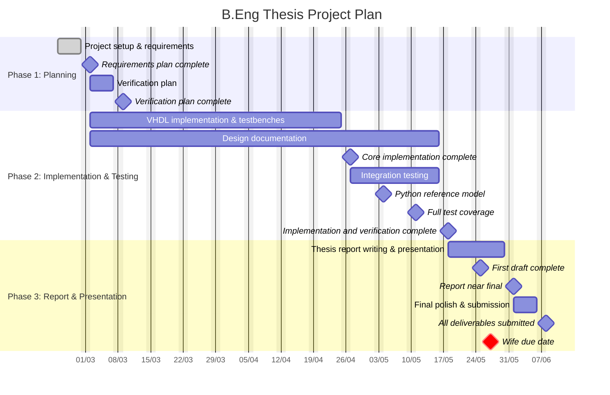

<!-- omit in toc -->
# B.Eng Thesis Project Plan

**Project**: FD CAN bus extension, ISO 11898-1:2015 (CC & FD)
**Period**: 23/02/2026 to 07/06/2026 (15 weeks)
**Deliverables**: Thesis report, VHDL implementation, verification suite (VHDL + Python), defense presentation

---

<!-- omit in toc -->
## Table of Contents
- [Project Brief (from Company Advisor)](#project-brief-from-company-advisor)
- [Phase Overview](#phase-overview)
- [Week by Week Plan](#week-by-week-plan)
- [Gantt Chart](#gantt-chart)
- [Risks](#risks)

---

## Project Brief (from Company Advisor)

> **FD CAN bus extension.**
>
> The goal of the project is to extend the, by Mads, previously designed CAN bus VHDL module to also include the Flexible Data rate (FD) protocol.
> This work will cover:
>
> 1. Initial project planning
> 2. Read and understand the FD CAN bus standard
> 3. Identify updates and how to test these updates
> 4. Implementation and testing on a module level
> 5. Incorporate the design into the existing engine controller
> 6. Write test SW in Python
> 7. Document the design

---

## Phase Overview

| Phase | Name | Weeks | Description |
|:------|:-----|:------|:------------|
| 1 | Planning | 1 to 2 | Requirements plan, verification plan. |
| 2 | Implementation & Testing | 3 to 12 | VHDL implementation, testbenches, Python tools. |
| 3 | Report & Presentation | 13 to 15 | Write report, create and rehearse presentation. |

---

## Week by Week Plan
<!-- omit in toc -->
### Week 1 (23/02 to 01/03): Project Setup & Requirements

| Task | Status |
|:------|:--------|
| Environment and toolchain setup. | Done |
| Create project plan (this document). | Done |
| Create requirements plan (IDs, ISO refs, acceptance criteria). | |

**Milestone**: Requirements plan complete.

<!-- omit in toc -->
### Week 2 (02/03 to 08/03): Verification Plan

| Task | Status |
|:------|:--------|
| Create verification plan. | |
| VHDL implementation per requirements plan. | |
| Module level testbenches. | |
| Design documentation (ongoing). | |

**Milestone**: Verification plan complete.

<!-- omit in toc -->
### Weeks 3 to 9 (09/03 to 26/04): VHDL Implementation

| Task | Status |
|:------|:--------|
| VHDL implementation per requirements plan. | |
| Module level testbenches. | |
| Design documentation (ongoing). | |

**Milestone**: Core implementation complete. Python reference model ready.

<!-- omit in toc -->
### Week 10 (27/04 to 03/05): Integration Testing & Python Setup

| Task | Status |
|:------|:--------|
| Python test framework setup. | |
| Develop and validate Python reference model. | |
| Integration testing. | |
| Design documentation (ongoing). | |

**Milestone**: Python reference model. Integration tests passing.

<!-- omit in toc -->
### Week 11 (04/05 to 10/05): Integration Testing

| Task | Status |
|:------|:--------|
| Regression testing. | |
| Python cross validation. | |
| Design documentation (ongoing). | |

**Milestone**: Full test coverage.

<!-- omit in toc -->
### Week 12 (11/05 to 17/05): Final Verification

| Task | Status |
|:------|:--------|
| Final test coverage and verification. | |
| Design documentation (ongoing). | |

**Milestone**: Implementation and verification complete.

<!-- omit in toc -->
### Week 13 (18/05 to 24/05): Thesis Report Writing

| Task | Status |
|:------|:--------|
| Write thesis report. | |

**Milestone**: First draft complete.

<!-- omit in toc -->
### Week 14 (25/05 to 31/05): Thesis Revision & Presentation

| Task | Status |
|:------|:--------|
| Revise and polish thesis report. | |
| Create presentation slide deck. | |

**Milestone**: Report near-final. Presentation draft exists.

<!-- omit in toc -->
### Week 15 (01/06 to 07/06): Presentation & Final Polish

| Task | Status |
|:------|:--------|
| Finalize slides and demo. | |
| Final thesis report polish. | |
| Submit thesis report and source code. | |

**Milestone**: All deliverables submitted. Defense-ready.

---

## Gantt Chart

---

## Risks

| Risk | Mitigation |
|:-----|:-----------|
| Implementation takes longer than planned. | Start early (week 2); requirements plan sets clear scope. |
| Report takes longer than estimated. | Collect screenshots and notes during implementation phase. |
| Verification reveals design issues late. | Develop verification plan in week 2; test continuously. |
| Python tools take too long. | Tight scope: CRC reference, frame generator, stuff bit check only. |
| Pregnancy or family emergencies may impact the project timeline. | Maintain flexibility in the schedule and communicate proactively with supervisors. |