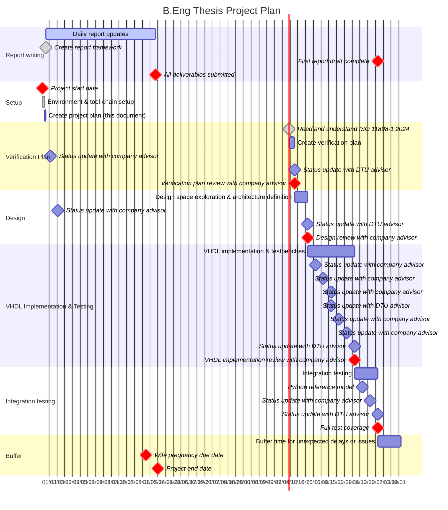

<!-- omit in toc -->

# B.Eng Thesis Project Plan

**Author:** Mads Richardt, s224948

---

<!-- omit in toc -->

## Table of Contents

- [Document Overview](#document-overview)
- [Key Stakeholders](#key-stakeholders)
- [Project Brief (from Company Advisor)](#project-brief-from-company-advisor)
- [Gantt Chart](#gantt-chart)
- [Risks and Mitigation Strategies](#risks-and-mitigation-strategies)

---

## Document Overview

This document presents the project plan for a Bachelor of Engineering thesis, conducted in collaboration with the company Everllence, focused on extending an existing CAN bus VHDL module to support the Flexible Data rate (FD) protocol ([ISO 11898-1:2024](https://www.iso.org/standard/86384.html)). The project runs from 23-02-2026 to 07-06-2026 (15 weeks) and will deliver a thesis report, VHDL implementation, and a verification suite (VHDL + Python). The plan outlines the objectives, timeline, deliverables, and key risks for the project.

---

## Key Stakeholders

- **Student:** Mads Richardt (DTU B.Eng candidate, s224948, <mads.richardt@gmail.com>)
- **DTU Advisor:** Edward Alexandru Todirica (Associate Professor, <eato@dtu.dk>)
- **Company Advisor:** Fredrik Kristensen (Everllence, <fredrik.kristensen@man-es.com>)

---

## Project Brief (from Company Advisor)

> **FD CAN bus extension.**
>
> The goal of the project is to extend the, by Mads, previously designed CAN bus VHDL module to also include the Flexible Data rate (FD) protocol.
> This work will cover:
>
> 1. Initial project planning
> 2. Read and understand the FD CAN bus standard
> 3. Identify updates and how to test these updates
> 4. Implementation and testing on a module level
> 5. Incorporate the design into the existing engine controller
> 6. Write test SW in Python
> 7. Document the design

---

## Gantt Chart

---

## Risks and Mitigation Strategies

|Risk|Mitigation|
|:---|:---|
|Project schedule slips due to underestimated tasks or unforeseen issues.|Build in buffer time. Review progress weekly. Prioritize critical tasks|
|Report writing takes longer than expected.|Maintain ongoing documentation. Set internal deadlines for drafts. Seek feedback regularly.|
|Late discovery of design or verification issues.|Develop and follow a detailed verification plan. Run regression tests frequently. Review design with advisors.|
| Python reference model development takes longer than expected.|Limit reference model to essential features (CRC reference, frame generator, bit stuffing check). Prototype early. Plan for integration testing with hardware and ensure tools are compatible with the target environment.| 
|Hardware integration or testing reveals unexpected issues.|Plan for early integration testing. Coordinate with company advisor for access to hardware and test environments. Document hardware requirements and constraints.|
| External factors (e.g., family emergencies, advisor availability) impact timeline. | Maintain flexibility. Communicate proactively with stakeholders. Adjust plan as needed.|
